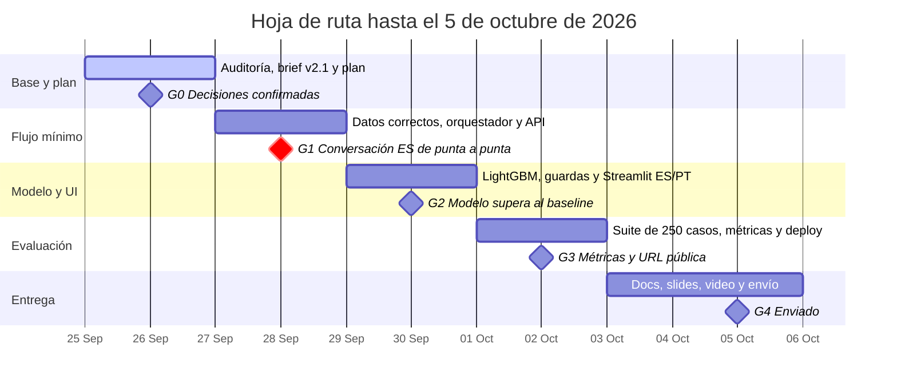

# Plan del equipo: intake de disputas

Actualizado: 2026-09-26. Este archivo es la fuente canónica de la pregunta problema, la planeación y la hoja de ruta. Hay dos copias para compartir: el [Claude Doc](https://claude.ai/code/artifact/d6c4ec29-af5e-4435-88d8-bd05f4f9d603) y la [página de Notion](https://app.notion.com/p/3e77b60f246881bd8b16c760101f058d). Si una copia difiere de este archivo, gana este archivo.

Construimos un sistema de intake de disputas en español y portugués que resuelve, protege o escala cada cargo no reconocido con acciones verificadas. Entregamos el 5 de octubre de 2026; hoy cerramos el día 2 de 10.

## 1. Pregunta problema

**¿Puede un sistema de intake de disputas en español y portugués resolver de forma segura y verificada los cargos no reconocidos elegibles de LATAM Bank, logrando más resolución segura automatizada que el baseline actual, sin aumentar los resultados inseguros y con latencia y costo medidos?**

Las quejas son el contacto más costoso del banco. Datos sintéticos del organizador: 686.296 interacciones y 67.095 quejas (`AGENTS.md` sección 7).

| Motivo de contacto | Volumen | Resolución en primer contacto | Requiere seguimiento | Minutos promedio |
| --- | --- | --- | --- | --- |
| Queja | 17,1% | 43,6% | 63% | 7,2 |
| Transaccional | 35,0% | 91,5% | 22% | 3,7 |

"Cargo no reconocido" (18,3%) y "Cobro indebido" (18,2%) suman el 36% de las quejas. Además, `transactions.is_fraud` da una etiqueta real para entrenar un modelo.

**Hipótesis**, todas sobre la misma suite held-out de 250 casos:

1. El sistema propuesto supera al baseline en resolución segura automatizada.
2. Los resultados inseguros no aumentan; se reportan como conteos con denominador.
3. El modelo de riesgo sin `fraud_score` supera a la línea base de reglas en la ventana temporal held-out.

**Cómo se mide:** las métricas oficiales, definidas en `docs/TEAM_BRIEF_COMPLEMENTED.md` sección 5. Resolución segura automatizada con el porcentaje de casos intentados, contención, calidad de escalamiento (transferencias omitidas e innecesarias), resultados inseguros, latencia p50 y p95, y costo por caso intentado y por resolución exitosa. Todo se corta por idioma, segmento y país.

**Límites conocidos:** el dataset no tiene portugués ni Brasil, así que los casos en portugués son generados por el equipo. El techo de $500 limita la contención a cerca del 53% de los cargos. La trampa de duplicados sigue sin resolver.

## 2. Planeación

**Alcance.** Un solo workflow: intake de disputas de transacciones. Dos acciones reales: abrir el caso y el bloqueo preventivo de tarjeta. Tres tipos de caso: normal, ambiguo o no soportado, y los que requieren humano. Español y portugués. Queda fuera mover dinero, aprobar créditos y cualquier otro workflow.

**Principio.** El modelo propone y la política determinista decide. El `customer_id` sale siempre del token de sesión, nunca del modelo ni del cuerpo de la petición.

**Supuestos.** "Hoy" es 2026-06-17, la fecha final del dataset. Todo el dataset es sintético. Los casos en portugués se etiquetan como generados por el equipo.

### Registro de decisiones

Se consulta al equipo antes de actuar sobre una fila Propuesta o Abierta. Al cerrar una, se cambia su estado aquí con la fecha.

| Decisión | Estado | Resolución o propuesta |
| --- | --- | --- |
| Base de operación | Decidida (26 sep) | SQLite `data/ops.sqlite` para casos, bloqueos, sesiones y auditoría; DuckDB solo lectura para la app |
| Etapa Understand | Decidida (26 sep) | Extractor determinista ES/PT por palabras clave ahora; un LLM después detrás de la misma interfaz |
| Flujo de git | Decidida (26 sep) | Ramas y un commit por fase con la suite en verde |
| `fraud_score` | Decidida (26 sep, por los datos) | Filtra la etiqueta: fuera del modelo y del baseline |
| Workflow | Propuesta | Intake de disputas; alternativa: elegibilidad de crédito |
| Crédito provisional | Propuesta | Solo marca de candidato para revisión humana (regla 8); el código aún lo trata como acción autónoma |
| Política de disputas | Propuesta | Cláusulas y orden del brief v2.1 |
| Techo de escalamiento de $500 | Propuesta | Mantenerlo y reportar el techo de contención de ~53% |
| Baseline | Propuesta | El pipeline inicial del repo, medido en la misma suite |
| Reconstruir o evolucionar | Propuesta | Evolucionar: conservar la estructura y construir el stack de disputas al lado |
| Explicaciones de política | Propuesta | Política como código con ids de cláusula; RAG solo si sobra tiempo |
| Componentes aprendidos | Propuesta | Modelo de fraude obligatorio; clasificador de intención opcional |
| Profundidad en portugués | Propuesta | Solo mensajes y respuestas en PT, generados por el equipo |
| UI y despliegue | Propuesta | Streamlit; Docker en Render o Fly.io con URL pública |
| Tamaño del equipo y dueños | Abierta | Asignar un dueño por frente |
| Confirmación del bloqueo preventivo | Abierta | ¿El cliente confirma antes del bloqueo? |
| Cargo disputable y palabras de angustia | Abierta | Cláusulas `POL-DISP-TYPE` y `POL-ESC-DISTRESS` del brief |
| Idioma de la documentación | Abierta | Español o inglés |

### Frentes de trabajo

Un dueño por frente.

| Frente | Entregables clave |
| --- | --- |
| Datos | Contratos, hora local, tipo de cambio por fecha, duplicados y llegadas tardías, carga completa para ML |
| ML y evaluación | LightGBM sin `fraud_score`, umbral por costo, MLflow, suite de 250 casos y reporte de métricas |
| Agente y backend | Orquestador de cinco etapas, gateway con verificación, SQLite de operación, sesión JWT, guardas de entrada |
| Analítica, UI y docs | Análisis de datos y calidad, Streamlit (chat y consola), README, slides y video |

## 3. Hoja de ruta

Cinco fases hasta el 5 de octubre; cada una cierra con un gate verificable. Primero se construye un flujo mínimo de punta a punta y después se amplía. G1 es el gate crítico: sin una conversación completa y verificada, el modelo y la UI no suman.

| Día | Fecha | Foco | Listo cuando |
| --- | --- | --- | --- |
| 2 | 26 sep | Auditoría, brief v2.1 y este plan; commitear el stack de disputas en una rama; confirmar el desfase horario en un CSV crudo | El equipo confirma o cambia cada decisión Propuesta |
| 3 | 27 sep | Datos: contratos, hora local, tipo de cambio por fecha, sondeo de duplicados y del prefijo de respaldo (máximo 2 h), ampliar la muestra a abril-junio para tener cargos fuera de ventana. Backend: SQLite de operación con auditoría, guardas y valores del diccionario en el gateway, cláusulas v2.1 | Cada arreglo tiene un test que falló primero y la ingesta corre con los contratos en verde |
| 4 | 28 sep | Orquestador de cinco etapas y varios turnos detrás de FastAPI y la sesión JWT; búsqueda del cargo y aclaración; generador de handoff | Una conversación en español recorre la API y termina en un caso verificado |
| 5 | 29 sep | ML con todos los años, split temporal, LightGBM contra baseline, umbral por costo, MLflow; conectar el riesgo y el conteo de 48 h; guardas de PII LATAM y etiquetas escapadas | El modelo supera al baseline en la ventana held-out y la corrida queda registrada |
| 6 | 30 sep | Streamlit: chat ES/PT y consola HITL; harness con los primeros 60 casos | Los tres tipos de caso corren en la UI en ambos idiomas |
| 7 | 1 oct | Suite completa de 250 casos con procedencia; baseline contra propuesto, 3 repeticiones, cortes por idioma, segmento y país | El reporte cubre cada métrica oficial con denominadores |
| 8 | 2 oct | Arreglar fallas; reintentos acotados, fallback seguro, trazas; despliegue | Una URL pública sirve la demo |
| 9 | 3 oct | README, arquitectura, métricas, limitaciones y ruta a producción; volver a correr el notebook | Cada afirmación de los docs coincide con el código y los datos |
| 10 | 4-5 oct | 4 a 6 slides, video de 3 minutos, renombrar el repo, correo de entrega | Entrega enviada a hackathon.admin@factored.ai |

Si hay atraso se recorta, en este orden: el clasificador de intención, MLflow (queda un log JSON) y el texto de política en portugués. Nunca se recorta el flujo de punta a punta, la verificación de acciones, el handoff, la comparación con el baseline, el despliegue ni el video.

## Fuentes

- [Problem Statement oficial (Google Doc)](https://docs.google.com/document/d/18AwONT8hQupRcfNPLFrPo6fHOJ_OUn1nBf-3jMnla2c/edit)
- [LATAM Bank Dataset Summary (PDF)](https://drive.google.com/file/d/1V7n9v0zuv9SYzpW2AzPnssgAp5X_buXc/view)
- [LATAM Bank Complete Data Dictionary (PDF)]([link to the organizer's data dictionary removed])
- Slides del kickoff: `docs/Datathon_2026_Kickoff.pdf` (copia local, fuera de git)
- `AGENTS.md`: reglas, hallazgos de datos verificados (sección 7) y brechas del código (sección 9)
- `docs/TEAM_BRIEF_COMPLEMENTED.md` v2.1: especificación de la política, del handoff y de la evaluación
