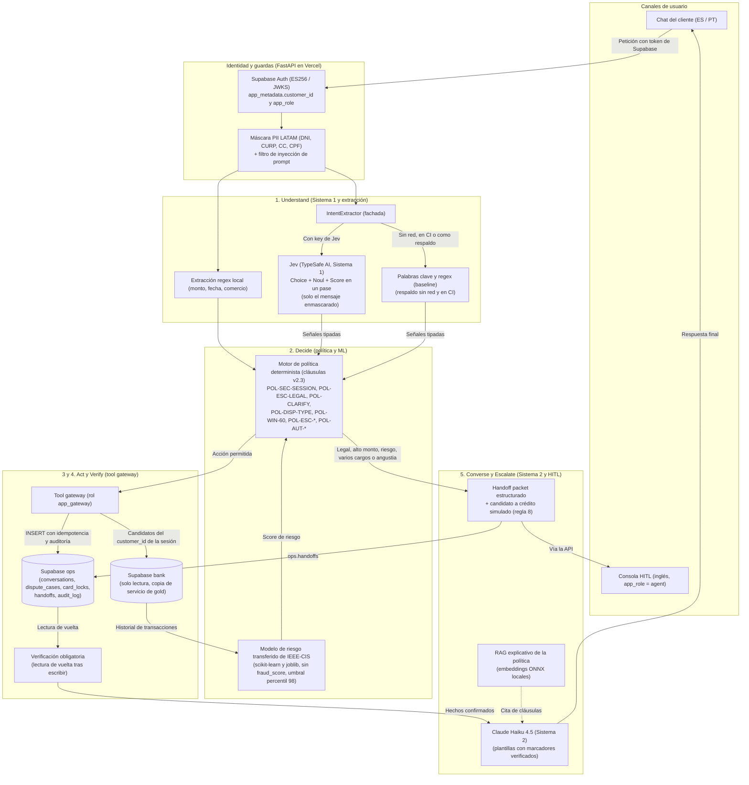
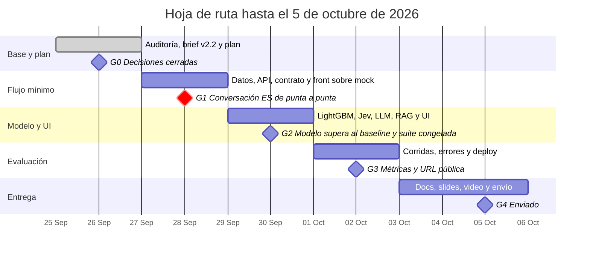

# Plan del equipo: intake de disputas

Actualizado: 2026-09-26. Este archivo es la fuente canónica de la pregunta problema, la planeación y la hoja de ruta. Hay dos copias para compartir: el [Claude Doc](https://claude.ai/code/artifact/d6c4ec29-af5e-4435-88d8-bd05f4f9d603) y la [página de Notion](https://app.notion.com/p/3e77b60f246881bd8b16c760101f058d). Si una copia difiere de este archivo, gana este archivo.

Construimos un sistema de intake de disputas en español y portugués que resuelve, protege o escala cada cargo no reconocido con acciones verificadas. Entregamos el 5 de octubre de 2026. Hoy cerramos el día 2 de 10 con el gate G0 cerrado: el equipo decidió todo el registro salvo las keys y el uso de datos, que dependen de terceros. El mismo día el equipo reemplazó el JWT propio y la SQLite de operación por Supabase (Auth y Postgres, plan Free) y eligió Vercel para el despliegue; diseño en `docs/SUPABASE_VERCEL.md`.

## 1. Pregunta problema

**¿Puede un sistema de intake de disputas en español y portugués resolver de forma segura y verificada los cargos no reconocidos elegibles de LATAM Bank, logrando más resolución segura automatizada que el baseline actual, sin aumentar los resultados inseguros y con latencia y costo medidos?**

Las quejas son el contacto más costoso del banco. Datos sintéticos del organizador: 686.296 interacciones y 67.095 quejas (`AGENTS.md` sección 7).

| Motivo de contacto | Volumen | Resolución en primer contacto | Requiere seguimiento | Minutos promedio |
| --- | --- | --- | --- | --- |
| Queja | 17,1% | 43,6% | 63% | 7,2 |
| Transaccional | 35,0% | 91,5% | 22% | 3,7 |

"Cargo no reconocido" (18,3%) y "Cobro indebido" (18,2%) suman el 36% de las quejas. Además, `transactions.is_fraud` parecía una etiqueta para entrenar un modelo; resultó sin señal aprendible, y el modelo servido se transfiere de IEEE-CIS (TQ-026).

**Hipótesis**, todas sobre la misma suite held-out de 250 casos, congelada antes de ajustar umbrales:

1. El sistema propuesto supera a los dos baselines (la versión solo reglas y el pipeline inicial) en resolución segura automatizada.
2. Los resultados inseguros no aumentan; se reportan como conteos con denominador.
3. El modelo de riesgo sin `fraud_score` supera a la línea base de reglas en la ventana temporal held-out.
4. Jev clasifica la intención mejor que el extractor por palabras clave, con calibración medida por separado en ES y PT.
5. La recuperación del RAG con embeddings multilingües supera a BM25 en recall@3 sobre preguntas de política en ES y PT.

**Cómo se mide:** las métricas oficiales, definidas en `docs/TEAM_BRIEF_COMPLEMENTED.md` sección 5. Resolución segura automatizada con el porcentaje de casos intentados, contención, calidad de escalamiento (transferencias omitidas e innecesarias), resultados inseguros, latencia p50 y p95, y costo por caso intentado y por resolución exitosa. Todo se corta por idioma, segmento y país.

**Límites conocidos:** el dataset no tiene portugués ni Brasil, así que los casos en portugués son generados por el equipo. El techo de $500 limita la contención a un máximo de 60,5% de los 8.967 cargos disputables de la muestra de junio, antes de los escalamientos por riesgo, legales, de varios cargos y de aclaración. La trampa de duplicados sigue sin resolver. La demo pública depende de Supabase y de Vercel en planes gratis: Supabase Free pausa un proyecto tras 7 días con poca actividad, y la mitigación (fila "Pausa de Supabase") reduce ese riesgo sin eliminarlo.

## 2. Planeación

**Alcance.** Un solo workflow: intake de disputas de transacciones. Dos acciones reales: abrir el caso y el bloqueo preventivo de tarjeta, este último con confirmación del cliente. Tres tipos de caso: normal, ambiguo o no soportado, y los que requieren humano. Español y portugués en el chat del cliente. Queda fuera mover dinero, aprobar créditos y cualquier otro workflow.

**Principio.** El modelo propone y la política determinista decide. El `customer_id` sale siempre del token de sesión de Supabase (`app_metadata`), nunca del modelo ni del cuerpo de la petición. El RAG explica la política, nunca la aplica.

**Supuestos.** "Hoy" es 2026-06-17, la fecha final del dataset. Todo el dataset es sintético. Los casos en portugués se etiquetan como generados por el equipo.

### Arquitectura del sistema y flujo de componentes

El sistema opera con **dos niveles de inteligencia (Sistema 1 y Sistema 2)** coordinados por un orquestador determinista, sobre el flujo canónico de cinco etapas: **Understand -> Decide -> Act -> Verify -> Escalate**. Lo marcado "(propuesta)" depende de filas Propuesta del registro de decisiones.

#### 1. Separación cognitiva: Sistema 1 (Jev) y Sistema 2 (Claude Haiku 4.5)

- **Sistema 1 (Jev, TypeSafe AI):** decisiones rápidas, estructuradas y probabilísticas. Según TypeSafe: de 70 a 500 ms de latencia, $0,042 por millón de tokens de entrada, tokens de salida gratis y salidas que siempre cumplen el esquema (garantiza el formato, no el acierto, que se mide). Recibe **solo el mensaje enmascarado** del cliente (`masked_message`), nunca filas del dataset ni PII. En un único pase evalúa:
  - `Choice` (hasta 255 opciones): intención (`cargo_no_reconocido`, `cobro_indebido`, `tarjeta_robada`, `consulta_general`, `fuera_de_alcance`). Decidido (brief v2.3): aclarar si la confianza de la intención es menor a 0,70. Propuesta: decidir por la masa de probabilidad sumada de las opciones de disputa y aclarar solo entre 0,30 y 0,70.
  - `Noul` (0,0 a 1,0): probabilidad de tarjeta robada o perdida (`is_stolen_reported`). Decidido: el bloqueo preventivo se ofrece desde 0,80 y se aclara entre 0,40 y 0,60; el cliente siempre confirma con Sí o No. Propuesta: ofrecerlo desde 0,50, porque el cliente confirma.
  - `Score` (0,0 a 3,0): valor esperado de angustia o vulnerabilidad (`customer_distress_score`). Decidido: `score >= 2` escala a revisión humana (`POL-ESC-DISTRESS`). Propuesta: bajar el umbral a 1,5.
- **Sistema 2 (Claude Haiku 4.5):** redacta las respuestas en ES y PT sobre plantillas con marcadores (`{merchant}`, `{amount}`, `{case_id}`, `{clause_id}`) que el código rellena con datos ya verificados en la base. No toma decisiones de negocio ni aporta hechos.

#### 2. Principio rector: "Jev interpreta, el código decide"

- Jev emite juicios tipados con probabilidades que TypeSafe declara calibradas (entrenamiento RLCD, *Reinforcement Learning for Calibrated Decisions*). La calibración se mide por idioma en nuestro set de ES y PT.
- El motor de política en Python gobierna las reglas de negocio, los umbrales con su razón de costo y los permisos de las herramientas. (Propuesta) Leer la masa de probabilidad combinada de las opciones de disputa evita pedir aclaración cuando el modelo duda entre dos subcategorías de disputa válidas.

#### 3. Las cinco etapas en detalle

1. **Entrada e identidad:**
   - Supabase Auth: verificación ES256 contra el JWKS del proyecto. `customer_id` y `app_role` salen solo de `app_metadata`, nunca del cuerpo ni de `user_metadata`.
   - Máscara de PII LATAM (DNI, CURP, cédula de ciudadanía, CPF). Monto y fecha se extraen por regex antes de enmascarar, para que un monto de 7 dígitos en COP o ARS no se confunda con un teléfono.
2. **Understand:**
   - Fachada desacoplada `IntentExtractor` (propuesta; contrato común en [`JEV_TYPESAFE_AI.md`, sección 4](JEV_TYPESAFE_AI.md#4-reparticion-de-roles-jev-vs-llm-vs-codigo)).
   - `KeywordIntentExtractor`: baseline determinista por reglas y palabras clave; permite tests y CI sin costo ni dependencias externas.
   - `JevIntentExtractor`: `typesafe-sdk==0.7.1` con el modelo fijo `jev-1.13.0` (propuesta, fila "Versiones de Jev").
   - Extracción de slots (monto, fecha, comercio): regex determinista primero; si falla, un LLM de apoyo con salida estructurada (`json_schema`).
3. **Decide:**
   - Motor de política determinista en Python con las cláusulas del brief v2.3 en su orden canónico.
   - Modelo de riesgo LightGBM entrenado sobre `transactions.is_fraud` sin la fuga `fraud_score`, con el umbral fijado por el costo asimétrico de una transferencia omitida. Se sirve exportado a ONNX (propuesta, fila "Runtime de inferencia"). Estado (3 oct): `is_fraud` no tiene señal aprendible (TQ-023), así que el modelo servido es el transferido de la competencia IEEE-CIS (TQ-026), con scikit-learn y joblib en vez de LightGBM y ONNX (TQ-022), y su umbral es el percentil 98 de los cargos Web y App de la ventana.
4. **Act y Verify (tool gateway):**
   - El gateway escribe en Supabase Postgres con el rol restringido `app_gateway` (esquema `ops`: `conversations`, `dispute_cases`, `card_locks`, `handoffs`, `audit_log`) usando claves de idempotencia.
   - Lee los cargos candidatos del `customer_id` de la sesión en `bank`, la copia de servicio de solo lectura publicada desde gold.
   - **Verificación estricta:** antes de informar al cliente, el gateway lee de vuelta el registro creado en `ops`. El bloqueo preventivo exige confirmación explícita (Sí o No) del cliente.
5. **Escalate y explicabilidad:**
   - Handoff packet: JSON con la petición del cliente ya enmascarada, hechos verificados, evidencia, acciones tomadas, cláusulas aplicadas y, si aplica, la marca de candidato a crédito provisional simulado que un humano aprueba o rechaza (regla 8: nunca se mueve dinero).
   - Consola HITL en inglés para operadores (`app_role = "agent"`), con visor de la auditoría append-only.
   - RAG de explicaciones: embeddings multilingües locales (ONNX) sobre el texto de política en español escrito por el equipo. Explica y cita la cláusula, pero nunca cambia una decisión del código.

#### 4. Patrones de LangGraph sin acoplarse al framework (propuesta, fila "LangGraph y LangSmith")

Tomados del ejemplo de LangChain con Jev y de la documentación de TypeSafe (sección Fuentes):

- **Sin la librería LangGraph:** protege la ruta crítica a G1 y la regla 7, porque la verdad del sistema vive en Supabase Postgres (`ops`) y no en memoria ni en checkpoints de LangGraph o LangSmith.
- **Sus patrones sí se adoptan:**
  - Ruteo como funciones puras sobre señales tipadas.
  - Estados explícitos de espera en el orquestador (`awaiting_clarification`, `awaiting_confirmation`).
  - Inyección de dependencias en el clasificador (cambio transparente entre baseline, Jev y mocks).
  - Persistencia mínima: la auditoría y el estado de la conversación guardan ids y valores de señales tipadas, nunca el texto crudo. El handoff solo lleva la petición del cliente ya enmascarada (brief, sección 3.4).

### Registro de decisiones

G0 se cerró el 26 de sep en una sesión de grilling. Se consulta al equipo antes de actuar sobre una fila Abierta, o antes de cambiar una Decidida. Al cerrar o cambiar una, se actualiza su estado aquí con la fecha.

| Decisión | Estado | Resolución |
| --- | --- | --- |
| Workflow | Decidida (26 sep) | Intake de disputas; la alternativa de elegibilidad de crédito queda descartada |
| Equipo | Decidida (26 sep) | 4 personas en tres frentes: A para el perfil actuarial o de ML, B para el perfil de APIs y backend, C para las 2 personas nuevas desde el 27 sep. Daniel es dueño de este archivo |
| Nombre del equipo y repo | Decidida (26 sep) | AlterEgo; repo público `factored-hackathon-2026-alterego` |
| Idioma | Decidida (26 sep) | Entregables en inglés (README, reporte, slides, video). Plan interno en español. Chat del cliente en ES/PT. Consola HITL en inglés |
| Fuente canónica del plan | Decidida (26 sep) | Este archivo; Notion es la copia con la que el equipo se sincroniza |
| Flujo de git | Decidida (26 sep) | Una rama por frente. Cada PR a `main` necesita la revisión de otro frente y un GitHub Action en verde (tests y build del front). Daniel hace el merge. GitHub Free no protege ramas de un repo privado: `main` se protege en GitHub cuando el repo sea público (día 10) y hasta entonces la regla vale por convención |
| Reconstruir o evolucionar | Decidida (26 sep) | Evolucionar: conservar la estructura y construir el stack de disputas al lado del baseline |
| Arquitectura de la app | Decidida (26 sep; despliegue revisado el 26 sep) | React + TypeScript (Vite) servido por FastAPI en un solo dominio; la plataforma está en la fila "Despliegue". Contrato OpenAPI cerrado el 27 sep a mediodía; el front arranca contra un mock y genera sus tipos desde ese contrato |
| Identidad | Decidida (26 sep) | Supabase Auth reemplaza el JWT HS256 propio (`src/auth/session.py`). FastAPI verifica el token de Supabase; `customer_id` y el rol de la consola salen de `app_metadata` del token, nunca del cuerpo, del modelo ni de `user_metadata`. Diseño: `docs/SUPABASE_VERCEL.md` sección 3 |
| Base de operación | Decidida (26 sep, revisada el mismo día) | Supabase Postgres reemplaza a SQLite `data/ops.sqlite`: esquema `ops` para conversaciones, casos, bloqueos, handoffs y auditoría append-only; esquema `bank` con el subconjunto de servicio publicado desde gold, de solo lectura para la app. DuckDB queda local para ingesta, ML y notebook, fuera de la app. Diseño: `docs/SUPABASE_VERCEL.md` sección 4 |
| Política de disputas | Decidida (26 sep) | Cláusulas y orden del brief v2.3 tal cual; Transfer es disputable |
| Crédito provisional | Decidida (26 sep) | Solo marca de candidato (regla 8): un humano lo aprueba o rechaza en la consola, y el cliente oye que su caso quedó registrado y en revisión, nunca que se aplicó un crédito |
| Techo de escalamiento de $500 | Decidida (26 sep) | Se mantiene. Se reporta el techo de contención de 60,5% de los cargos disputables y una tabla de sensibilidad del notebook ($300, $500 y $1.000) |
| Confirmación del bloqueo preventivo | Decidida (26 sep) | El cliente confirma con Sí o No. Si dice que no, queda registrado en el caso y en el handoff |
| Cargo disputable y angustia | Decidida (26 sep) | `POL-DISP-TYPE` del brief; angustia con Jev Score >= 2 y palabras clave de respaldo (`POL-ESC-DISTRESS`) |
| Understand y conversación | Decidida (26 sep) | Jev (TypeSafe AI) da señales tipadas (intención, robo de tarjeta, angustia) sobre el mensaje enmascarado. Regex y un LLM de apoyo extraen monto, fecha y comercio. Claude redacta las respuestas con marcadores. Todo lo determinista queda en código. Diseño: `docs/JEV_TYPESAFE_AI.md` |
| Acceso a Jev | Decidida (26 sep) | Pedir acceso (lista de espera en console.typesafe.ai). Sin key, el extractor de respaldo (regex y palabras clave) es el default y el baseline. Sin fecha límite |
| Proveedor del LLM | Decidida (26 sep) | Claude Haiku 4.5 (`claude-haiku-4-5-20251001`); un mock en los tests |
| Datos que ven los modelos | Decidida (26 sep) | Solo el mensaje enmascarado. Los LLM redactan con marcadores en inglés (`{amount}`, `{case_id}`; `{monto}` es el marcador sin rellenar de las transcripciones del dataset) y el código los rellena con datos verificados: ningún modelo ve registros del dataset |
| Explicaciones de política | Decidida (26 sep) | Política como código con ids de cláusula, más RAG sobre un texto de política en español escrito por el equipo (unos 15 fragmentos, uno por cláusula). El RAG nunca cambia una decisión, cita la cláusula que recuperó y se abstiene si la similitud es baja |
| Embeddings del RAG | Decidida (26 sep; respaldo revisado el mismo día por Vercel) | Modelo multilingüe local en ONNX, sin torch, cuantizado a int8 para caber en el bundle de 500 MB de Vercel. Respaldo: Large Functions de Vercel (beta, hasta 5 GB); la instancia paga con torch deja de aplicar porque no se paga ningún plan. Los embeddings del corpus se calculan en el build. Ningún texto sale a un tercero |
| Profundidad en portugués | Decidida (26 sep) | Solo para la interacción con el cliente; el texto de política queda en español |
| Baselines | Decidida (26 sep) | Dos. Principal: la arquitectura propia en versión solo reglas (palabras clave, política v2.3, riesgo por reglas sin `fraud_score`, plantillas; sin Jev, LightGBM, LLM ni RAG). Referencia: el pipeline inicial con un adaptador y su crash arreglado; sus bloqueos sin verificar y su promesa de reembolso cuentan como resultados inseguros |
| Componentes aprendidos | Decidida (26 sep); el modelo de fraude cambió el 29 sep y el 2 oct (TQ-026, TQ-022) | Modelo de fraude (obligatorio; hoy el transferido de IEEE-CIS con scikit-learn, no LightGBM), Jev para intención y la recuperación del RAG, cada uno contra su baseline: reglas, palabras clave y BM25 |
| Suite de evaluación | Decidida (26 sep); etiquetado humano descartado el 4 oct (TQ-018) | 250 casos held-out y 60 de desarrollo. Cada persona escribe casos desde cargos reales (`synthetic-organizer`) con mensajes `team-generated`; se puede parafrasear con un LLM, con revisión humana. Etiquetado repartido entre los 4, con kappa sobre 50 casos etiquetados dos veces. La suite se congela con commit y hash el 30 sep, antes de ajustar umbrales. Congelada el 30 sep: `data/eval/heldout_cases.jsonl` (250 casos, 150 ES y 100 PT, generados por `src/eval/heldout.py` desde la muestra reconstruida), SHA-256 en `data/eval/heldout_cases.sha256`; sus expectativas son etiquetas de diseño. El etiquetado humano con las planillas de `data/eval/labeling/` y el kappa no se hicieron, y se declaran como limitación (TQ-018, 4 oct). La primera corrida (30 sep) encontró 7 problemas; los 6 de código se arreglaron ese día, cada uno con su propio test, sin tocar la suite ni los umbrales (PR apilado `pr/8`); el que queda (compras extranjeras sin puntaje de riesgo) depende de evaluar con el modelo cargado |
| UI | Decidida (26 sep) | Chat ES/PT con los cargos candidatos y la confirmación del bloqueo como botones. Consola en inglés con casos, handoffs, candidatos a crédito y visor del log de auditoría. Sin dashboard; un panel con resultados de la evaluación solo si sobra tiempo el día 8 |
| Acceso a la consola | Decidida (26 sep, revisada el mismo día) | Token de Supabase con `app_metadata.app_role = "agent"` en los endpoints de la consola (el claim `role` de Supabase está reservado para el rol de Postgres); la suite incluye un cliente que intenta abrirla y recibe 403 |
| Tests del front | Decidida (26 sep) | Humo end-to-end con Playwright de los tres tipos de caso y del 403; sirve de guion para el video |
| Alcance | Decidida (26 sep); OpenTelemetry dado de baja el 4 oct (TQ-036) | Sin recortes: se mantienen el LLM de apoyo, Jev y OpenTelemetry. El 4 oct OpenTelemetry se da de baja y queda como trabajo futuro: el log de auditoría append-only (`ops.audit_log`) es el registro de cada acción |
| `fraud_score` | Decidida (26 sep, por los datos) | Filtra la etiqueta: fuera del modelo y del baseline |
| Auditoría de seguridad (Cloudflare) | Decidida (26 sep) | Se adoptó la metodología de cloudflare/security-audit-skill. Hallazgos SEC-01 a SEC-06 documentados en docs/SECURITY_AUDIT_PLAN.md y programados para remediación en días 3-5. SEC-07 a SEC-10 (Supabase y Vercel) agregados el 26 sep |
| Keys y presupuesto | Decidida (27 sep): tope de 2 USD por día para las keys externas (`src/llm/budget.py`, `ops.llm_usage`); dueño por key pendiente | Sin definir quién crea las keys de Anthropic y de TypeSafe ni el tope de gasto. Sin key de Anthropic el día 5, las respuestas salen de plantillas. Supabase Pro queda descartado (26 sep): Supabase y Vercel se usan en sus planes gratis |
| Uso de datos en el despliegue y en los modelos | Decidida (2 oct, TQ-032): aprobado por los mentores | Según Daniel (2 oct), los mentores lo aprobaron; esa parte está en la cuenta de Kmilo y queda a cargo de él. Antes: pregunta a mentores en `#technical-help` pendiente de enviar (día 2). Con Supabase, los datos de servicio viven en un tercero: se publica solo el subconjunto minimizado de `docs/SUPABASE_VERCEL.md` sección 4.2, sin `is_fraud`, `fraud_score`, números de tarjeta, documentos ni contactos. Si no permiten publicar datos, el mismo script carga en Supabase una base de fixtures del equipo con el mismo esquema |
| Despliegue | Decidida (26 sep) | Vercel (Hobby) reemplaza a Render: un proyecto, FastAPI como función de Python y el build de React por CDN con `app.frontend()`, región `iad1` junto a Supabase `us-east-1`. Respaldos: proyecto Vite aparte con rewrite de `/api`, y Large Functions o imagen de contenedor si el bundle pasa 500 MB. Deploy esqueleto el 28 sep. Diseño: `docs/SUPABASE_VERCEL.md` sección 6. Estado (3 oct): en producción en <https://alterego-silk.vercel.app>, sobre un solo proyecto de Supabase que también es producción; `alterego-demo` no se creó y el canario no existe |
| Pausa de Supabase | Decidida (26 sep) | Sin plan pago. Mitigación: canario doble e independiente (cron diario de Vercel y un workflow programado de GitHub Actions cada 12 h) que ingresa con una persona dedicada, lee `bank`, escribe una entrada `CANARY` en la auditoría y la lee de vuelta; si falla, el Action falla y avisa a Daniel. Daniel revisa el dashboard el 8, el 12 y el 15 oct y restaura el proyecto si hace falta. Riesgo residual declarado: Supabase no documenta qué cuenta como actividad. Diseño: `docs/SUPABASE_VERCEL.md` sección 6.8 |
| Modelo de identidad | Propuesta (26 sep) | Personas de prueba con email y contraseña creadas por script con la secret key local; registro público deshabilitado; claims `app_metadata.customer_id` y `app_metadata.app_role`; verificación ES256 contra el JWKS del proyecto (sin secreto compartido); emisor local solo en tests y harness, bloqueado en producción; credenciales de jurados solo en el correo de entrega |
| Proyectos y datos en Supabase | Propuesta (26 sep) | Dos proyectos Free en `us-east-1`: `alterego-dev` (previews, CI end-to-end, harness) y `alterego-demo` (producción). `bank` recargable y de solo lectura; mutaciones solo en `ops`; rol `app_gateway` sin `BYPASSRLS` ni `DELETE`; nada expuesto por la Data API; migraciones versionadas en `supabase/migrations/`. El MCP inspecciona con `read_only=true` y no aplica cambios que el repo no tenga |
| Subconjunto publicado en Supabase | Propuesta (26 sep, según los datos) | Ventana del 1 abr al 17 jun 2026: 54.157 transacciones de 18.756 clientes de la muestra, con 32.109 cargos disputables en ventana y 9.358 reales fuera de ventana (61 a 77 días) para los casos de abstención. Clientes: solo los de la suite (desarrollo y held-out), las personas de la demo y el canario; la muestra completa sigue en DuckDB, donde se arma la suite. El tamaño no decide (la muestra completa cabe holgada en 500 MB); decide la minimización (regla 10). Hasta congelar la suite, `alterego-dev` recibe las personas y los clientes de desarrollo. Evidencia: `docs/SUPABASE_VERCEL.md` sección 4.2 |
| Runtime de inferencia | Decidida (2 oct, TQ-022): se mantiene scikit-learn con joblib para esta entrega | Servir el modelo exportado a ONNX con `onnxruntime` desde el inicio; LightGBM solo para entrenar. Medido el 26 sep: la rueda Linux de `lightgbm` 4.7.0 exige `libgomp.so.1` del sistema (no la incluye) y arrastra `scipy` (112 MB sin comprimir); `onnxruntime` 1.30.0 pesa 64 MB, no pide librerías del sistema y ya lo necesitan los embeddings. El deploy esqueleto lo confirma. Medido el 1 oct (`docs/SUPABASE_VERCEL.md` 6.3): `scikit-learn` y `scipy`, que sirven hoy el modelo de riesgo, ocupan 143 MB de los 358 MB del runtime; servirlo en ONNX es además lo que deja caber E5 (unos 466 MB contra 609 MB). Cerrada el 2 oct (TQ-022): quedan tres días, así que el modelo de riesgo se sirve como hoy y E5 no entra en el bundle |
| Versión de Python | Decidida (26 sep, por evidencia) | 3.12 en local, CI y Vercel. Los 28 paquetes directos del stack (datos, ML, ONNX, API, Supabase) y el SDK de Jev resuelven a la misma última versión con wheels binarias en Linux y Windows para 3.12, 3.13 y 3.14; Vercel no ofrece 3.11. Desempate: 3.12 es la versión por defecto de Vercel, el camino más probado |
| Harness y autenticación | Decidida (26 sep) | Dos modos: local (emisor local y Postgres local: repeticiones, sesiones vencidas, tokens forjados) y desplegado (personas reales con ritmo bajo el límite de Auth; de ahí sale la latencia). El reporte dice de qué modo sale cada métrica |
| Lectura de las señales de Jev | Propuesta (26 sep); aclaración de intención Decidida (29 sep, TQ-024): se mantiene la confianza por opción y las intenciones quedan siempre independientes; cuando un mensaje trae varias, la aclaración las lista al cliente para que aclare cada una, nunca se suman en una masa. Angustia y bloqueo siguen en Propuesta | `Score.score` es un valor esperado y `confidence` mide concentración, no acierto (doc oficial de TypeSafe y ejemplo de LangChain del 25 sep). Se leen bandas y la confianza solo filtra la zona ambigua. Umbrales de partida: angustia con `score` >= 1,5 (hoy >= 2); bloqueo ofrecido desde robo >= 0,50, porque el cliente lo confirma (hoy >= 0,80, con aclaración entre 0,40 y 0,60); aclaración de intención según la suma de probabilidades de las opciones de disputa, entre 0,30 y 0,70 (hoy confianza < 0,70). Cada umbral lleva escrita su razón de costo y se fija por motor en el split de desarrollo. Si se aprueba, se actualiza el brief (`POL-CLARIFY`, `POL-ESC-DISTRESS` y bloqueo). Detalle: `docs/JEV_TYPESAFE_AI.md`, secciones 2.D y 3 |
| Plan B del modelo de decisión | Propuesta (26 sep) | Complementa "Acceso a Jev" sin cambiarla. Si en la fecha de corte que propone la revisión adversarial (H05: 29 sep, 12:00) no hay key de Jev, se prueba SemIf (`semif-qwen3.5-4b`) por el LangSmith Gateway, que solo pide la key de LangSmith, antes de sacar la hipótesis 4. Por verificar: costo, retención de datos y calidad en ES y PT |
| Brazos de la hipótesis 4 | Propuesta (26 sep) | Un contrato de clasificador común y el mismo orquestador y política para todos los brazos: palabras clave (baseline), Jev, SemIf si está disponible y Claude Haiku como clasificador (un adaptador que pide probabilidades por opción). Por motor se reportan latencia, tokens, costo, acuerdo entre motores, y exactitud y calibración contra las etiquetas, por idioma. La doc de TypeSafe dice que el inglés es su idioma principal y que los demás están menos optimizados, así que la ventaja en ES y PT no está garantizada |
| Versiones de Jev | Propuesta (26 sep) | `typesafe-sdk==0.7.1` (existe en PyPI desde el 21 sep; 5 versiones en 12 días) y modelo `jev-1.13.0`, no los alias `jev-latest` ni `jev-preview`, que cambian solos con cada release. Cada llamada guarda `model` y `request_id` en el log de auditoría |
| Tests de Jev sin key | Propuesta (26 sep) | El adaptador de Jev se prueba sin red: clasificador stub por cada rama de la política, valores fraccionarios en las fronteras y un test del cliente real sobre `httpx2.MockTransport`. Choca con la recomendación H05 de no escribir código de Jev antes de tener key; el equipo decide si el costo lo justifica |
| LangGraph y LangSmith | Propuesta (26 sep) | No se adopta LangGraph para el orquestador: B es la ruta crítica a G1, un checkpoint no es el sistema de registro (regla 7) y el estado ya vive en Postgres (`ops`). Se toman sus patrones: ruteo como funciones puras sobre señales tipadas, estados explícitos de espera (confirmación y aclaración) y persistencia mínima (ids y señales, nunca el texto crudo). LangSmith queda fuera salvo que los mentores permitan enviar datos a un tercero; el `trace_id` y el log de auditoría siguen obligatorios |
| SemIf fuera del Plan B | Propuesta (26 sep, revisión tecnológica) | Cambia la fila "Plan B del modelo de decisión". No hay documentación pública de `semif-qwen3.5-4b` (versión, licencia, retención, desempeño en ES y PT), y LangSmith Cloud guarda trazas 14 días en su nivel base. Si no hay key de Jev al corte del 29 sep a las 12:00, el experimento se congela y queda el extractor de respaldo. Se reabre solo con documentación oficial del modelo, aprobación escrita del uso de datos y tracing desactivado. Detalle: `docs/reviews/2026-09-26-revision-tecnologica.md` |
| Datos del organizador en Supabase | Propuesta (26 sep, revisión tecnológica) | Afecta "Uso de datos en el despliegue y en los modelos" (Abierta) y "Subconjunto publicado en Supabase". Invierte el default: `alterego-dev` y `alterego-demo` cargan fixtures `team-generated` con el mismo esquema hasta que los mentores respondan por escrito; solo entonces se publica el subconjunto del organizador, con el origen registrado por fila. El script cambia de dataset sin cambiar código. Minimizar no equivale a tener autorización: Supabase es un tercero aunque no sea un modelo (regla 10) |
| LLM de apoyo sin montos ni comercios | Propuesta (26 sep, revisión tecnológica) | Cambia en parte "Understand y conversación" (Decidida): se consulta al equipo. Cuando el enmascarador deje de tapar montos (`AGENTS.md` sección 9), el mensaje que llega al LLM de apoyo traerá montos y comercios del cliente. Opciones: extraer monto, fecha y comercio solo con regex local, o llamar al LLM de apoyo solo cuando el regex falla y registrar la llamada en la auditoría. Pendiente elegir |
| Modelo de embeddings y respaldo del RAG | Propuesta (26 sep, revisión tecnológica) | Completa "Embeddings del RAG" (Decidida), que no nombra modelo: se consulta al equipo. Fijar `intfloat/multilingual-e5-small` en ONNX int8 con repositorio, revisión o hash, tokenizer y prefijos `query:` y `passage:`; BGE-M3 queda descartado por tamaño (2,27 GB). Los embeddings entran a la demo solo si superan a BM25 en recall@3 y en acierto del `clause_id`, por idioma, sobre las preguntas de política etiquetadas; si no, la demo usa BM25. Implementado el 1 oct para medirlo offline (`src/rag/onnx_retriever.py`, revisión `614241f6` con SHA-256 verificado, PR #24); la regla de decisión (Tarea 4.2 de `docs/RAG_IMPLEMENTATION_ROADMAP.md`) se fija antes de medir el test. 2 oct (TQ-022): en Vercel va BM25 y E5 queda como medida offline |
| Presupuesto de 500 MB sin Large Functions | Propuesta (26 sep, revisión tecnológica) | Cambia el respaldo de "Embeddings del RAG" y de "Despliegue" (Decididas): se consulta al equipo. Se diseña para el bundle de 500 MB y Large Functions (beta) deja de ser respaldo; si el bundle no cabe, el RAG cae a BM25. El deploy esqueleto del 28 sep (ya en G1) mide además el arranque en frío en p50 y p95 y el tiempo de instalación. Medido el 1 oct en Linux con Python 3.12 (sin deploy esqueleto todavía): el runtime pasó de 595 MB a 358 MB al separar el grupo `dev` (PR #23); sin E5 el bundle queda en unos 377 MB y con E5 en unos 609 MB, así que hoy el RAG desplegable es BM25 (`docs/SUPABASE_VERCEL.md` 6.3) |
| Retención de proveedores externos | Propuesta (26 sep, revisión tecnológica) | Completa "Datos que ven los modelos" sin cambiarla. La API de Anthropic guarda entradas y salidas hasta 30 días y la retención cero exige un acuerdo aparte: que ningún registro del dataset salga no significa que ningún texto del cliente salga. Se declara en las limitaciones del reporte (regla 11). La retención de TypeSafe se verifica antes de la primera llamada a Jev |
| Resoluciones de la spec de política (P1 a P7) | Decidida (27 sep, ratificada por el equipo: "ratify all") | Definiciones en `docs/technical-discuss-points.md` sección 2, ya en código en `src/rules/dispute_policy.py`: cláusulas secundarias en la decisión, memoria de casos que alimenta `POL-ESC-DISTRESS` en los dos modos, lista cerrada de categorías fuera de alcance con barrera de confianza, bloqueo recomendado en cualquier resultado con id `POL-AUT-LOCK`, matriz de autenticación por acción, `amount_usd` nulo escala. Si el equipo cambia una definición, cambia la spec y su test en el mismo commit |
| Desbloqueo de tarjeta como acción de consola | Decidida (27 sep, "ratify all") | Las acciones reales siguen siendo dos (abrir caso y bloqueo preventivo). El desbloqueo sería una tercera, de nivel alto: reingreso del cliente más aprobación de un agente en la consola, con auditoría; nunca desde el chat. La matriz `ACTION_AUTH_MATRIX` ya lo declara; no se construye hasta que esta fila sea Decidida |
| Perfil de cliente y explicación del riesgo | Decidida (27 sep): perfil por cliente con datos compartibles y no compartibles separados; la explicación del riesgo la ven solo el agente humano y el agente de IA; se construye después de G1 | `docs/specs/customer-profile-risk-explanation-spec.docx`: perfil por cliente como datos en `ops` (hechos por código más temas de Jev sobre los mensajes enmascarados), SHAP del modelo de fraude calculado fuera de línea y publicado como columnas, herramientas de solo lectura con allowlist, panel en la consola. Aterriza después de G1 (días 5 a 8). No cambia la fila "Datos que ven los modelos" |
| Limpieza de `amount_usd` con marca y columna legada | Decidida (27 sep): en silver, con `amount_usd_legacy`, `amount_usd_source` y `amount_usd_fx_rate`; gold lleva solo `amount_usd` corregido y su origen. En código | `docs/technical-discuss-points.md` sección 1: 291 vacíos reales (COP y ARS, 5 %) con tasa diaria disponible; relleno con la tasa media del día de proceso (reproduce los valores nativos dentro de 2 %), columnas `amount_usd_source` y `amount_usd_legacy`, sin fallback a 1.0, carga falla sin tasa. Frente A, día 3 |
| Hipótesis 3 sobre estos datos | Propuesta (27 sep, con evidencia) | En la carga completa (4,4 M de transacciones, 4.316 fraudes) la tasa de fraude es plana en todas las features sin fuga y el modelo y el baseline de reglas quedan en ROC AUC 0,50 sobre 1,5 M de filas held-out; solo `fraud_score` (la fuga) separa las clases. Opciones en TQ-023: reportar el resultado negativo con el pipeline como evidencia (recomendado), buscar un objetivo proxy con estructura real, o dejar el baseline de reglas como señal. `POL-ESC-ML-RISK` queda en la política sin modelo cargado por defecto |
| Modelo de riesgo transferido de IEEE-CIS | Decidida (29 sep, TQ-026): `POL-ESC-ML-RISK` escala a HITL por el umbral de percentil de la ventana de servicio, sin el 0,70 fijo; el modelo de registro usa solo las variables homologadas; proceso posterior de cherry-picking entre las unas 400 variables excluidas para que el agente las consuma y mejore el score tras la entrevista con el cliente (`reports/ml/ieee_cis_feature_importance.md`); la licencia de los datos de la competencia sigue pendiente de los mentores | Como `is_fraud` no muestra señal aprendible y `fraud_score` deriva de él, el score de `POL-ESC-ML-RISK` sale de un modelo entrenado en la competencia IEEE-CIS Fraud Detection (Kaggle, 590.540 transacciones etiquetadas, 3,5% fraude) sobre un contrato de features calculable en nuestros cargos (monto USD, hora de proceso, crédito o débito, antigüedad de la tarjeta, conteos y agregados por tarjeta y cliente, distancia de dirección, chequeos de consistencia); validado en el split temporal de la competencia con validación adversarial del cambio de dominio; umbral por percentil (top 2% de cargos disputables de la ventana) en lugar del 0,70 absoluto. La tabla de identidad no tiene equivalente (`digital_events` no se une a un cargo). Mapeo y plan en `docs/specs/fraud-risk-model-v1-ieee-cis.md`; TQ-026 |
| Validador de zona de riesgo junto al score | Propuesta (3 oct, Kmilo; TQ-038) | `src/tools/risk_zone.py` lee cada cargo identificado sin modelo: dónde se hizo frente al país y la ciudad del cliente (`HOME`, `DOMESTIC_OTHER_CITY`, `ABROAD`, `UNKNOWN`); la zona de riesgo es `ABROAD`. Corre en todos los canales, también en el 70% que el modelo no puntúa. Hoy es un hecho para el agente humano (fila de auditoría `RISK_ZONE_VALIDATED` con el cruce contra el modelo, y una línea en los hechos verificados del handoff): no cambia ningún resultado ni llega al cliente. En la ventana de 60 días el 4,6% de los cargos está en el exterior; en Web y App el modelo marca 1.508 cargos y la zona 3.441, ambos 180. Falta decidir qué dispara un cargo en zona de riesgo (solo aviso, un escalamiento nuevo o la oferta de bloqueo): las dos últimas cambian la política v2.3. Un mapa de zonas dentro de una ciudad necesita una fuente externa citada, porque los datos solo traen país y ciudad. `docs/technical-discuss-points.md` sección 9 |
| Cierre de keys y presupuesto | Propuesta (26 sep, revisión tecnológica) | Para cerrar "Keys y presupuesto" (Abierta). La app funciona sin Jev ni Anthropic: las keys mejoran, no habilitan. Un dueño por key; presupuesto total y diario; consumo en `ops.llm_usage`; timeout, reintentos acotados y apagado por proveedor; ninguna key en previews de forks; rotación al terminar. Falta decidir quién es dueño de cada key y el monto |
| Cargos hermanos del cargo disputado | Propuesta (3 oct, en código en la rama `feat/sibling-charges`; TQ-039) | Al abrir y verificar un caso, la respuesta le cuenta al cliente sus otros cargos disputables del mismo producto, comercio y día de proceso que aún no tienen caso, y una escalación los deja como hecho verificado en el handoff. Se informan, no se cuentan: `POL-ESC-MULTI` sigue contando cargos disputados y ninguna cláusula, umbral ni orden cambia. Los datos no permiten medirlo (sin id de terminal, 77,9 % de las filas sin comercio, ninguna tarjeta con más de dos transacciones en un día de proceso), así que se demuestra con fixtures del equipo. Las métricas de las dos suites quedaron idénticas antes y después. Falta decidir si una ráfaga de hermanos también debe escalar con oferta de bloqueo (`docs/technical-discuss-points.md` sección 10) |

### Frentes de trabajo

| Frente | Quién | Entregables clave |
| --- | --- | --- |
| A: datos, ML y evaluación | Perfil actuarial o de ML | Contratos de datos, fecha de proceso, tipo de cambio por fecha, muestra abril-junio, migración de `bank` y publicación del subconjunto de servicio a Supabase con contratos de paridad, carga completa para ML, LightGBM sin `fraud_score`, MLflow, tabla de sensibilidad del techo, harness, coordinación del etiquetado y reporte de métricas |
| B: agente y backend | Perfil de APIs y backend | Contrato OpenAPI, GitHub Action con Postgres, esquema `ops` en Supabase y rol `app_gateway`, gateway con verificación sobre Postgres, política v2.3, orquestador de cinco etapas, `IntentExtractor` (respaldo y Jev), extracción de slots, Claude con marcadores, RAG (texto de política y embeddings locales), verificación del token de Supabase con roles y protección de endpoints (SEC-01/02/03), guardas de entrada y escape XML (SEC-04), máscara PII LATAM (SEC-05), RLS por cliente (SEC-07), adaptador del pipeline inicial, OpenTelemetry, despliegue en Vercel |
| C: front | Las 2 personas nuevas | React + TypeScript (Vite): ingreso con `@supabase/supabase-js` (clave publicable, solo Auth), chat ES/PT y consola en inglés, tipos generados desde OpenAPI, mock del backend, deploy esqueleto en Vercel, humo e2e con Playwright |
| Daniel | Dueño del plan | Proyectos de Supabase (dev y demo) y de Vercel, MCP en solo lectura, script de personas, variables de entorno por ambiente, decisión de pago |
| Todos | Los 4 | Etiquetado de la suite (días 5 y 6); README, reporte y slides en inglés, video y entrega (días 9 y 10) |

## 3. Hoja de ruta

Cinco fases hasta el 5 de octubre; cada una cierra con un gate verificable. Primero se construye un flujo mínimo de punta a punta y después se amplía. G1 es el gate crítico: sin una conversación completa y verificada, el modelo y la UI no suman.

| Día | Fecha | Frente A | Frente B | Frente C | Listo cuando |
| --- | --- | --- | --- | --- | --- |
| 2 | 26 sep | Hecho: desfase horario confirmado en el CSV crudo; código y notebook commiteados; sondeo de abril a junio en S3 (patrones de la suite y nulos de `amount_usd`) | Hecho: G0 cerrado; Supabase (plan Free), Vercel, Python 3.12 y el harness en dos modos decididos. Pendiente: enviar la pregunta a mentores y pedir acceso a Jev | Se suma el 27 | G0: registro de decisiones cerrado, salvo keys y datos |
| 3 | 27 sep | Contratos, fecha de proceso, tipo de cambio por fecha, muestra abril-junio (el sondeo de duplicados y del prefijo de respaldo se hizo el 26 sep: sin duplicados, y el respaldo es otra generación de datos; `AGENTS.md` sección 7); migración de `bank`, lista de clientes a publicar (`data/serving_customers.json`) y script de publicación a `alterego-dev` con contratos de paridad. Hecho el 27 sep (sesión autónoma): migración `bank` (`supabase/migrations/0003_bank.sql`) con `business_today()` y las vistas vivas, `src/data/publish_serving.py` con contratos de paridad y sin fallback 1.0, harness de evaluación `src/eval/` con el split de desarrollo de 18 casos y el adaptador del pipeline inicial, pipeline del modelo de riesgo sin `fraud_score` (`src/ml/fraud_risk.py`). Pendiente: relleno de `amount_usd` en silver con marca y columna legada (TQ-001 a TQ-003), carga completa (TQ-013) | Daniel, a primera hora: proyectos de Supabase en `us-east-1`, inspección de solo lectura con el MCP, personas de prueba y proyecto de Vercel. B: contrato OpenAPI a mediodía; GitHub Action con Postgres 17; migración de `ops` con auditoría append-only y rol `app_gateway`; verificador del token de Supabase (JWKS, ES256) y emisor local para tests; guardas y valores del diccionario en el gateway; cláusulas v2.3; remediación SEC-01 (rol de la consola), SEC-02 (customer_id desde el token) y SEC-03 (sin secreto compartido); Python 3.12. Hecho el 27 sep: cláusulas v2.3 con 55 tests (`docs/specs/dispute-policy-v2.3.md`), migración `ops` (0001, 0002) con auditoría append-only y rol `app_gateway`, verificador ES256 contra JWKS con emisor local (SEC-03), consola detrás del rol `agent` (SEC-01), `customer_id` solo del token (SEC-02), escape XML en el gateway (SEC-04), máscara PII LATAM sin colisión de montos (SEC-05), orquestador de cinco etapas con casos, bloqueo confirmado y handoff, API de chat y consola, cola de preguntas al equipo, GitHub Action con Postgres, imagen Docker con el front. Hecho el 29 sep: proyecto de Supabase creado por Daniel (`https://lrddokaihdwrdtwfiale.supabase.co`, JWKS con clave ES256 verificado; TQ-020). Pendiente: personas de prueba, proyecto de Vercel, Python 3.12 en local | Leer AGENTS.md; estructura base de React + TypeScript contra el mock; tipos desde OpenAPI; pantalla de ingreso con `supabase-js` contra `alterego-dev`. Hecho el 27 sep: front React + TypeScript en `frontend/` (ingreso con personas, chat ES/PT con candidatos y confirmación del bloqueo, consola con casos, handoffs, bloqueos, auditoría y preguntas) contra la API real; pendiente el ingreso con `supabase-js` | Cada arreglo tiene un test que falló primero; la ingesta y la publicación corren con los contratos en verde; el contrato está publicado |
| 4 | 28 sep | Carga de transacciones 2023-2026 y features; baseline de reglas sin `fraud_score`; tabla de sensibilidad del techo | Orquestador de cinco etapas y varios turnos detrás de FastAPI y el token de Supabase; gateway sobre Postgres; `IntentExtractor` con el respaldo; regex de monto y fecha; búsqueda del cargo, aclaración y confirmación del bloqueo; handoff; texto de política del RAG; escape XML en gateway (SEC-04); medir bundle, memoria y arranque en frío en el deploy esqueleto (ONNX, LightGBM) | Chat ES/PT contra el mock, con botones de aclaración y de confirmación; deploy esqueleto en Vercel: front, `/health`, ingreso y una lectura de `bank` | G1: una conversación en español recorre la API y termina en un caso verificado en Supabase; el deploy esqueleto responde en Vercel |
| 5 | 29 sep | LightGBM contra baseline, split temporal, umbral por costo, MLflow; conectar el riesgo a la política | Jev si hay key; LLM de apoyo y Claude con marcadores; RAG con embeddings locales; guardas de PII LATAM sin colisión de montos (SEC-05); RLS por cliente con `SET LOCAL` (SEC-07); endpoints de la consola (casos, handoffs, aprobación de candidatos a crédito, auditoría) detrás del rol `agent` | Consola en inglés: casos, handoffs, candidatos a crédito, visor de auditoría, rol `agent` | El modelo supera al baseline en la ventana held-out; conversaciones ES y PT pasan por el LLM |
| 6 | 30 sep | Harness de evaluación; coordinar el etiquetado; kappa; ajustar la mezcla de la suite a los patrones medidos (`AGENTS.md` sección 7) y congelarla con commit y hash | Adaptador del pipeline inicial (crash de precedencia ya resuelto en 8632e96); OpenTelemetry | Integración con el backend real; humo e2e con Playwright | G2: los tres tipos de caso corren en la UI en ES y PT; suite congelada. Los días 5 y 6 etiquetan los 4 |
| 7 | 1 oct | Corridas: dos baselines contra propuesto, Jev contra palabras clave, RAG contra BM25; 3 repeticiones; cortes por idioma, segmento y país. 2 oct: el banco de preguntas de política (redactado por un LLM; Daniel lo aceptó con las desviaciones declaradas) se corrió y el explicador quedó encendido con BM25 (`reports/rag_benchmark.md`) | Reintentos acotados, fallback seguro, simulación de fallas de herramientas. Hecho el 1 oct, fuera de lo previsto: benchmark del RAG (Tarea 4.1), dependencias de runtime separadas y bundle medido (PR #23), buscador E5 offline (PR #24). Pendiente de lo previsto: los reintentos acotados (TQ-028); las fallas simuladas y la derivación por caída del banco existen desde el 30 sep | Pulir la UI con los hallazgos de las corridas | El reporte cubre cada métrica oficial con denominadores |
| 8 | 2 oct | Análisis de errores y arreglos | Producción en Vercel contra `alterego-demo` con los datos aprobados o los fixtures; personas de los jurados; canario doble (cron de Vercel y GitHub Actions) en verde; advisors de Supabase sin hallazgos | Humo e2e contra el despliegue; panel de resultados si sobra tiempo | G3: una URL pública sirve la demo |
| 9 | 3 oct | README, arquitectura y reporte en inglés; volver a correr el notebook | Limitaciones y ruta a producción en inglés | Capturas y guion del video desde el e2e | Cada afirmación de los docs coincide con el código y los datos |
| 10 | 4-5 oct | Slides en inglés | Repo público `factored-hackathon-2026-alterego`; correo de entrega | Video de 3 minutos | G4: entrega enviada a `hackathon.admin@factored.ai` |
| Post | 6 a 16 oct | | Daniel: canario en verde; revisión del dashboard de Supabase el 8, el 12 y el 15 oct, y restauración si el proyecto se pausó | | La URL pública responde durante el juzgamiento |

Sin recortes de alcance (decidido el 26 sep). Si hay atraso, lo primero que cede es el panel de resultados y después OpenTelemetry (queda el log de auditoría). Nunca cede el flujo de punta a punta, la verificación de acciones, el handoff, la comparación con los baselines, el tracking del modelo, el despliegue ni el video.

## Fuentes

- [Problem Statement oficial (Google Doc)](https://docs.google.com/document/d/18AwONT8hQupRcfNPLFrPo6fHOJ_OUn1nBf-3jMnla2c/edit)
- [LATAM Bank Dataset Summary (PDF)](https://drive.google.com/file/d/1V7n9v0zuv9SYzpW2AzPnssgAp5X_buXc/view)
- LATAM Bank Complete Data Dictionary (PDF): lo compartió el organizador; no se enlaza desde el repo porque trae las llaves de AWS
- Slides del kickoff: `docs/Datathon_2026_Kickoff.pdf` (copia local, fuera de git)
- `AGENTS.md`: reglas, hallazgos de datos verificados (sección 7) y brechas del código (sección 9)
- `docs/TEAM_BRIEF_COMPLEMENTED.md` v2.4: especificación de la política (cláusulas v2.3), del handoff y de la evaluación
- `docs/JEV_TYPESAFE_AI.md`: diseño de la integración de Jev (señales, cláusulas, reparto de roles con los LLM)
- [Ejemplo de LangChain con Jev y LangGraph (blog, 25 sep 2026)](https://www.langchain.com/blog/building-prod-with-jev-and-langgraph) y su [gist con código y mediciones](https://gist.github.com/sydney-runkle/a632ba4ea0b2b72501dfa4b6ab2a7d8a): fuente de las filas Propuesta del 26 sep sobre Jev
- [Documentación oficial de TypeSafe](https://docs.typesafe.ai): modelos, tipos de preguntas y de respuestas
- `docs/SECURITY_AUDIT_PLAN.md`: matriz de riesgos, hallazgos confirmados SEC-01 a SEC-06, preventivos SEC-07 a SEC-10 y criterios de aceptación por gate (metodología Cloudflare)
- `docs/SUPABASE_VERCEL.md`: identidad con Supabase Auth, esquemas `bank` y `ops`, seguridad de la base, despliegue en Vercel, sondeo de datos para el subconjunto publicado, riesgos y fuentes oficiales verificadas el 26 sep
- `docs/reviews/2026-09-26-revision-adversarial-plan.md` (hallazgos H01 a H34) y `docs/reviews/2026-09-26-reuso-lead-agent-crm-starter.md` (qué reusar del starter): revisiones del 26 sep, con una nota de estado al inicio de cada una
- `docs/prompts/fable_sdd_tdd.md`: prompt para desarrollo guiado por spec y por tests
