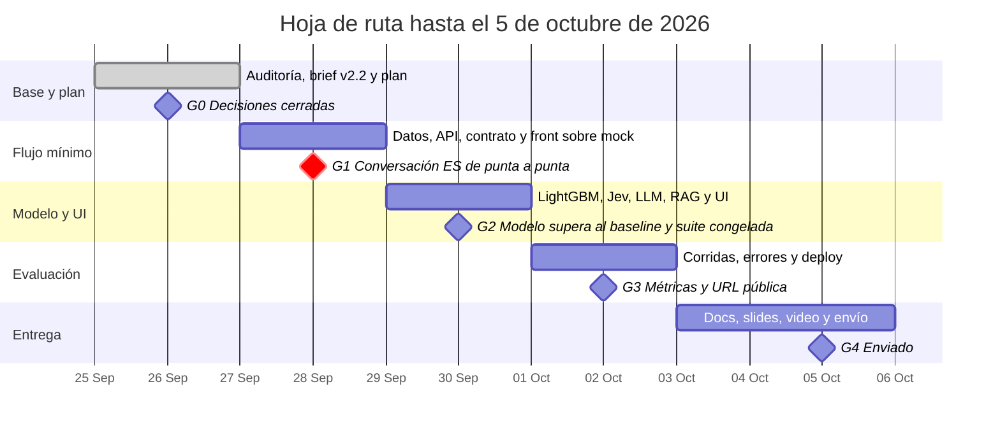

# Plan del equipo: intake de disputas

Actualizado: 2026-09-26. Este archivo es la fuente canónica de la pregunta problema, la planeación y la hoja de ruta. Hay dos copias para compartir: el [Claude Doc](https://claude.ai/code/artifact/d6c4ec29-af5e-4435-88d8-bd05f4f9d603) y la [página de Notion](https://app.notion.com/p/3e77b60f246881bd8b16c760101f058d). Si una copia difiere de este archivo, gana este archivo.

Construimos un sistema de intake de disputas en español y portugués que resuelve, protege o escala cada cargo no reconocido con acciones verificadas. Entregamos el 5 de octubre de 2026. Hoy cerramos el día 2 de 10 con el gate G0 cerrado: el equipo decidió todo el registro salvo las keys y el uso de datos, que dependen de terceros.

## 1. Pregunta problema

**¿Puede un sistema de intake de disputas en español y portugués resolver de forma segura y verificada los cargos no reconocidos elegibles de LATAM Bank, logrando más resolución segura automatizada que el baseline actual, sin aumentar los resultados inseguros y con latencia y costo medidos?**

Las quejas son el contacto más costoso del banco. Datos sintéticos del organizador: 686.296 interacciones y 67.095 quejas (`AGENTS.md` sección 7).

| Motivo de contacto | Volumen | Resolución en primer contacto | Requiere seguimiento | Minutos promedio |
| --- | --- | --- | --- | --- |
| Queja | 17,1% | 43,6% | 63% | 7,2 |
| Transaccional | 35,0% | 91,5% | 22% | 3,7 |

"Cargo no reconocido" (18,3%) y "Cobro indebido" (18,2%) suman el 36% de las quejas. Además, `transactions.is_fraud` da una etiqueta real para entrenar un modelo.

**Hipótesis**, todas sobre la misma suite held-out de 250 casos, congelada antes de ajustar umbrales:

1. El sistema propuesto supera a los dos baselines (la versión solo reglas y el pipeline inicial) en resolución segura automatizada.
2. Los resultados inseguros no aumentan; se reportan como conteos con denominador.
3. El modelo de riesgo sin `fraud_score` supera a la línea base de reglas en la ventana temporal held-out.
4. Jev clasifica la intención mejor que el extractor por palabras clave, con calibración medida por separado en ES y PT.
5. La recuperación del RAG con embeddings multilingües supera a BM25 en recall@3 sobre preguntas de política en ES y PT.

**Cómo se mide:** las métricas oficiales, definidas en `docs/TEAM_BRIEF_COMPLEMENTED.md` sección 5. Resolución segura automatizada con el porcentaje de casos intentados, contención, calidad de escalamiento (transferencias omitidas e innecesarias), resultados inseguros, latencia p50 y p95, y costo por caso intentado y por resolución exitosa. Todo se corta por idioma, segmento y país.

**Límites conocidos:** el dataset no tiene portugués ni Brasil, así que los casos en portugués son generados por el equipo. El techo de $500 limita la contención a un máximo de 60,5% de los 8.967 cargos disputables de la muestra de junio, antes de los escalamientos por riesgo, legales, de varios cargos y de aclaración. La trampa de duplicados sigue sin resolver.

## 2. Planeación

**Alcance.** Un solo workflow: intake de disputas de transacciones. Dos acciones reales: abrir el caso y el bloqueo preventivo de tarjeta, este último con confirmación del cliente. Tres tipos de caso: normal, ambiguo o no soportado, y los que requieren humano. Español y portugués en el chat del cliente. Queda fuera mover dinero, aprobar créditos y cualquier otro workflow.

**Principio.** El modelo propone y la política determinista decide. El `customer_id` sale siempre del token de sesión, nunca del modelo ni del cuerpo de la petición. El RAG explica la política, nunca la aplica.

**Supuestos.** "Hoy" es 2026-06-17, la fecha final del dataset. Todo el dataset es sintético. Los casos en portugués se etiquetan como generados por el equipo.

### Registro de decisiones

G0 se cerró el 26 de sep en una sesión de grilling. Se consulta al equipo antes de actuar sobre una fila Abierta, o antes de cambiar una Decidida. Al cerrar o cambiar una, se actualiza su estado aquí con la fecha.

| Decisión | Estado | Resolución |
| --- | --- | --- |
| Workflow | Decidida (26 sep) | Intake de disputas; la alternativa de elegibilidad de crédito queda descartada |
| Equipo | Decidida (26 sep) | 4 personas en tres frentes: A para el perfil actuarial o de ML, B para el perfil de APIs y backend, C para las 2 personas nuevas desde el 27 sep. Daniel es dueño de este archivo |
| Nombre del equipo y repo | Decidida (26 sep) | AlterEgo; repo público `factored-hackathon-2026-alterego` |
| Idioma | Decidida (26 sep) | Entregables en inglés (README, reporte, slides, video). Plan interno en español. Chat del cliente en ES/PT. Consola HITL en inglés |
| Fuente canónica del plan | Decidida (26 sep) | Este archivo; Notion es la copia con la que el equipo se sincroniza |
| Flujo de git | Decidida (26 sep) | Una rama por frente. Cada PR a `main` necesita la revisión de otro frente y un GitHub Action en verde (tests y build del front). Daniel hace el merge y `main` queda protegida |
| Reconstruir o evolucionar | Decidida (26 sep) | Evolucionar: conservar la estructura y construir el stack de disputas al lado del baseline |
| Arquitectura de la app | Decidida (26 sep) | React + TypeScript (Vite) servido por FastAPI en un solo contenedor en Render. Contrato OpenAPI cerrado el 27 sep a mediodía; el front arranca contra un mock y genera sus tipos desde ese contrato |
| Base de operación | Decidida (26 sep) | SQLite `data/ops.sqlite` para casos, bloqueos, sesiones y auditoría; DuckDB solo lectura para la app |
| Política de disputas | Decidida (26 sep) | Cláusulas y orden del brief v2.3 tal cual; Transfer es disputable |
| Crédito provisional | Decidida (26 sep) | Solo marca de candidato (regla 8): un humano lo aprueba o rechaza en la consola, y el cliente oye que su caso quedó registrado y en revisión, nunca que se aplicó un crédito |
| Techo de escalamiento de $500 | Decidida (26 sep) | Se mantiene. Se reporta el techo de contención de 60,5% de los cargos disputables y una tabla de sensibilidad del notebook ($300, $500 y $1.000) |
| Confirmación del bloqueo preventivo | Decidida (26 sep) | El cliente confirma con Sí o No. Si dice que no, queda registrado en el caso y en el handoff |
| Cargo disputable y angustia | Decidida (26 sep) | `POL-DISP-TYPE` del brief; angustia con Jev Score >= 2 y palabras clave de respaldo (`POL-ESC-DISTRESS`) |
| Understand y conversación | Decidida (26 sep) | Jev (TypeSafe AI) da señales tipadas (intención, robo de tarjeta, angustia) sobre el mensaje enmascarado. Regex y un LLM de apoyo extraen monto, fecha y comercio. Claude redacta las respuestas con marcadores. Todo lo determinista queda en código. Diseño: `docs/JEV_TYPESAFE_AI.md` |
| Acceso a Jev | Decidida (26 sep) | Pedir acceso (lista de espera en console.typesafe.ai). Sin key, el extractor de respaldo (regex y palabras clave) es el default y el baseline. Sin fecha límite |
| Proveedor del LLM | Decidida (26 sep) | Claude Haiku 4.5 (`claude-haiku-4-5-20251001`); un mock en los tests |
| Datos que ven los modelos | Decidida (26 sep) | Solo el mensaje enmascarado. Los LLM redactan con marcadores (`{monto}`, `{caso}`) y el código los rellena con datos verificados: ningún modelo ve registros del dataset |
| Explicaciones de política | Decidida (26 sep) | Política como código con ids de cláusula, más RAG sobre un texto de política en español escrito por el equipo (unos 15 fragmentos, uno por cláusula). El RAG nunca cambia una decisión, cita la cláusula que recuperó y se abstiene si la similitud es baja |
| Embeddings del RAG | Decidida (26 sep) | Modelo multilingüe local en ONNX, sin torch; respaldo: sentence-transformers con torch en una instancia paga. Los embeddings del corpus se calculan al construir la imagen. Ningún texto sale a un tercero |
| Profundidad en portugués | Decidida (26 sep) | Solo para la interacción con el cliente; el texto de política queda en español |
| Baselines | Decidida (26 sep) | Dos. Principal: la arquitectura propia en versión solo reglas (palabras clave, política v2.3, riesgo por reglas sin `fraud_score`, plantillas; sin Jev, LightGBM, LLM ni RAG). Referencia: el pipeline inicial con un adaptador y su crash arreglado; sus bloqueos sin verificar y su promesa de reembolso cuentan como resultados inseguros |
| Componentes aprendidos | Decidida (26 sep) | LightGBM de fraude (obligatorio), Jev para intención y la recuperación del RAG, cada uno contra su baseline: reglas, palabras clave y BM25 |
| Suite de evaluación | Decidida (26 sep) | 250 casos held-out y 60 de desarrollo. Cada persona escribe casos desde cargos reales (`synthetic-organizer`) con mensajes `team-generated`; se puede parafrasear con un LLM, con revisión humana. Etiquetado repartido entre los 4, con kappa sobre 50 casos etiquetados dos veces. La suite se congela con commit y hash el 30 sep, antes de ajustar umbrales |
| UI | Decidida (26 sep) | Chat ES/PT con los cargos candidatos y la confirmación del bloqueo como botones. Consola en inglés con casos, handoffs, candidatos a crédito y visor del log de auditoría. Sin dashboard; un panel con resultados de la evaluación solo si sobra tiempo el día 8 |
| Acceso a la consola | Decidida (26 sep) | JWT con `role: "agent"` en los endpoints de la consola; la suite incluye un cliente que intenta abrirla y recibe 403 |
| Tests del front | Decidida (26 sep) | Humo end-to-end con Playwright de los tres tipos de caso y del 403; sirve de guion para el video |
| Alcance | Decidida (26 sep) | Sin recortes: se mantienen el LLM de apoyo, Jev y OpenTelemetry |
| `fraud_score` | Decidida (26 sep, por los datos) | Filtra la etiqueta: fuera del modelo y del baseline |
| Keys y presupuesto | Abierta | Sin definir quién crea las keys de Anthropic y de TypeSafe ni el tope de gasto. Sin key de Anthropic el día 5, las respuestas salen de plantillas |
| Uso de datos en el despliegue y en los modelos | Abierta | Pregunta enviada a mentores en `#technical-help`. Si no permiten publicar datos, la demo usa una base de fixtures del equipo con el mismo esquema |

### Frentes de trabajo

| Frente | Quién | Entregables clave |
| --- | --- | --- |
| A: datos, ML y evaluación | Perfil actuarial o de ML | Contratos de datos, fecha de proceso, tipo de cambio por fecha, muestra abril-junio, carga completa para ML, LightGBM sin `fraud_score`, MLflow, tabla de sensibilidad del techo, harness, coordinación del etiquetado y reporte de métricas |
| B: agente y backend | Perfil de APIs y backend | Contrato OpenAPI, GitHub Action, SQLite de operación, gateway con verificación, política v2.3, orquestador de cinco etapas, `IntentExtractor` (respaldo y Jev), extracción de slots, Claude con marcadores, RAG (texto de política y embeddings locales), JWT con roles, guardas de entrada, adaptador del pipeline inicial, OpenTelemetry, despliegue en Render |
| C: front | Las 2 personas nuevas | React + TypeScript (Vite): chat ES/PT y consola en inglés, tipos generados desde OpenAPI, mock del backend, humo e2e con Playwright |
| Todos | Los 4 | Etiquetado de la suite (días 5 y 6); README, reporte y slides en inglés, video y entrega (días 9 y 10) |

## 3. Hoja de ruta

Cinco fases hasta el 5 de octubre; cada una cierra con un gate verificable. Primero se construye un flujo mínimo de punta a punta y después se amplía. G1 es el gate crítico: sin una conversación completa y verificada, el modelo y la UI no suman.

| Día | Fecha | Frente A | Frente B | Frente C | Listo cuando |
| --- | --- | --- | --- | --- | --- |
| 2 | 26 sep | Hecho: desfase horario confirmado en el CSV crudo; código y notebook commiteados | Hecho: G0 cerrado. Pendiente: enviar la pregunta a mentores y pedir acceso a Jev | Se suma el 27 | G0: registro de decisiones cerrado, salvo keys y datos |
| 3 | 27 sep | Contratos, fecha de proceso, tipo de cambio por fecha, muestra abril-junio, sondeo de duplicados y del prefijo de respaldo (máximo 2 h) | Contrato OpenAPI a mediodía; GitHub Action; SQLite de operación con auditoría; guardas y valores del diccionario en el gateway; cláusulas v2.3 | Leer AGENTS.md; estructura base de React + TypeScript contra el mock; tipos desde OpenAPI | Cada arreglo tiene un test que falló primero; la ingesta corre con los contratos en verde; el contrato está publicado |
| 4 | 28 sep | Carga de transacciones 2023-2026 y features; baseline de reglas sin `fraud_score`; tabla de sensibilidad del techo | Orquestador de cinco etapas y varios turnos detrás de FastAPI y JWT; `IntentExtractor` con el respaldo; regex de monto y fecha; búsqueda del cargo, aclaración y confirmación del bloqueo; handoff; texto de política del RAG; medir la memoria del modelo de embeddings | Chat ES/PT contra el mock, con botones de aclaración y de confirmación | G1: una conversación en español recorre la API y termina en un caso verificado |
| 5 | 29 sep | LightGBM contra baseline, split temporal, umbral por costo, MLflow; conectar el riesgo a la política | Jev si hay key; LLM de apoyo y Claude con marcadores; RAG con embeddings locales; guardas de PII LATAM y etiquetas escapadas | Consola en inglés: casos, handoffs, candidatos a crédito, visor de auditoría, rol `agent` | El modelo supera al baseline en la ventana held-out; conversaciones ES y PT pasan por el LLM |
| 6 | 30 sep | Harness de evaluación; coordinar el etiquetado; kappa; congelar la suite con commit y hash | Adaptador del pipeline inicial y arreglo de su crash; OpenTelemetry | Integración con el backend real; humo e2e con Playwright | G2: los tres tipos de caso corren en la UI en ES y PT; suite congelada. Los días 5 y 6 etiquetan los 4 |
| 7 | 1 oct | Corridas: dos baselines contra propuesto, Jev contra palabras clave, RAG contra BM25; 3 repeticiones; cortes por idioma, segmento y país | Reintentos acotados, fallback seguro, simulación de fallas de herramientas | Pulir la UI con los hallazgos de las corridas | El reporte cubre cada métrica oficial con denominadores |
| 8 | 2 oct | Análisis de errores y arreglos | Despliegue en Render (un contenedor) con los datos aprobados o los fixtures | Humo e2e contra el despliegue; panel de resultados si sobra tiempo | G3: una URL pública sirve la demo |
| 9 | 3 oct | README, arquitectura y reporte en inglés; volver a correr el notebook | Limitaciones y ruta a producción en inglés | Capturas y guion del video desde el e2e | Cada afirmación de los docs coincide con el código y los datos |
| 10 | 4-5 oct | Slides en inglés | Repo público `factored-hackathon-2026-alterego`; correo de entrega | Video de 3 minutos | G4: entrega enviada a `hackathon.admin@factored.ai` |

Sin recortes de alcance (decidido el 26 sep). Si hay atraso, lo primero que cede es el panel de resultados y después OpenTelemetry (queda el log de auditoría). Nunca cede el flujo de punta a punta, la verificación de acciones, el handoff, la comparación con los baselines, el tracking del modelo, el despliegue ni el video.

## Fuentes

- [Problem Statement oficial (Google Doc)](https://docs.google.com/document/d/18AwONT8hQupRcfNPLFrPo6fHOJ_OUn1nBf-3jMnla2c/edit)
- [LATAM Bank Dataset Summary (PDF)](https://drive.google.com/file/d/1V7n9v0zuv9SYzpW2AzPnssgAp5X_buXc/view)
- [LATAM Bank Complete Data Dictionary (PDF)]([link to the organizer's data dictionary removed])
- Slides del kickoff: `docs/Datathon_2026_Kickoff.pdf` (copia local, fuera de git)
- `AGENTS.md`: reglas, hallazgos de datos verificados (sección 7) y brechas del código (sección 9)
- `docs/TEAM_BRIEF_COMPLEMENTED.md` v2.3: especificación de la política, del handoff y de la evaluación
- `docs/JEV_TYPESAFE_AI.md`: diseño de la integración de Jev (señales, cláusulas, reparto de roles con los LLM)
