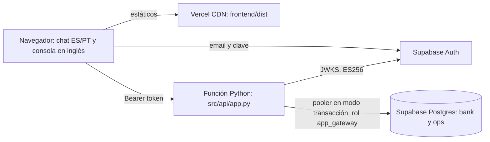

# CRISP-DM 6. Despliegue

AlterEgo está desplegado en <https://alterego-silk.vercel.app>. Una función de Python en Vercel sirve la API y el front de React. Supabase Auth emite la identidad y Supabase Postgres guarda dos cosas: una copia de solo lectura de los datos del banco y lo que el sistema escribe. Desde el 5-oct producción corre la política como código con el modelo de riesgo, Jev y el explicador de políticas con BM25. Esta fase cuenta cómo está armado, qué controles tiene, qué no corre y qué riesgos quedan para la ventana del jurado. Cómo usarlo está en [01-guia-de-uso.md](01-guia-de-uso.md).

## Resumen en una tabla

| Tema | Respuesta corta | Fuente |
| --- | --- | --- |
| URL | `/health` responde `healthy`, app "AlterEgo dispute intake", versión 0.1.0, `env` production | Auditoría del 4-oct, no comprometida en el repo; prueba de humo del 4-oct en `docs/HANDOFF.md` sec. 7.3; `src/api/app.py`, `src/core/config.py` |
| Código servido | `58ab501` (merge del PR #63), desplegado el 5-oct. Vercel Hobby había bloqueado los merges de #56 a #63, hechos por otra cuenta | Estados de despliegue de GitHub (`gh api`, 5-oct) |
| Plataforma | Vercel Hobby y un solo proyecto Supabase Free, que también es producción | [`docs/HANDOFF.md`](../HANDOFF.md) secs. 1 y 4; `README.md`, "Limitations" |
| Qué decide | La política, con las señales del modelo de riesgo, Jev (tope de 2 USD al día, extractor de respaldo) y el explicador BM25. Sin Claude: toda respuesta es plantilla. Ninguna corrida mide esta combinación junta | [`README.md`](../../README.md), "Limitations" |
| Riesgo mayor | La pausa del plan Free, sin el canario planeado para mitigarla, y el estado compartido de las personas de demo | Secciones 8 y 9 |

## 1. Arquitectura de producción

Tres servicios gestionados, todos en planes gratis (decidido el 26-sep; `docs/PLAN.md`, filas "Despliegue", "Identidad" y "Base de operación").

| Pieza | Qué hace en producción | Dónde está |
| --- | --- | --- |
| Función de Python | Corre `src.api.app:app`. Sin la línea `entrypoint`, Vercel tomaría el `main.py` de la raíz, que es el demo del baseline | [`pyproject.toml`](../../pyproject.toml), `[tool.vercel]` |
| Front | La app monta `frontend/dist` con `StaticFiles`. Sin middleware, Vercel promueve esos archivos a su CDN | `src/api/app.py`; `docs/SUPABASE_VERCEL.md` sec. 6.1 |
| Supabase Auth | Cuatro personas de demo con email y clave, creadas por script con la API de administración | [`src/auth/seed_personas.py`](../../src/auth/seed_personas.py), [`data/fixtures/personas.json`](../../data/fixtures/personas.json) |
| `bank` (`derived` de `synthetic-organizer`) | Copia minimizada de gold, sin `is_fraud`, `fraud_score`, documentos ni contactos: 253 clientes, 902 productos, 385 transacciones y 18 quejas. Solo lectura para la app; `publish_serving` la recarga completa y nunca toca `ops` | [`src/data/publish_serving.py`](../../src/data/publish_serving.py); `docs/HANDOFF.md` sec. 1 |
| `ops` (`team-generated`) | Conversaciones, mensajes, casos, bloqueos, handoffs, preguntas del equipo, auditoría y uso de LLM | `supabase/migrations/0001_ops.sql` a `0004_llm_usage.sql` |
| Conexión | Pooler en modo transacción (puerto 6543), psycopg con `prepare_threshold=None` y una conexión por llamada; el gateway usa 5 s de timeout de conexión | [`src/tools/gateway_postgres.py`](../../src/tools/gateway_postgres.py), [`src/ops/store.py`](../../src/ops/store.py); `docs/SUPABASE_VERCEL.md` sec. 6.7 |

**Identidad.** El front ingresa con supabase-js y manda el access token como `Bearer`. `SessionVerifier` acepta solo ES256 firmado con el JWKS del proyecto, con `aud = authenticated` y el `iss` del proyecto; HS256 o `alg: none` reciben 401. `customer_id` y `app_role` salen solo de `app_metadata`, que únicamente la secret key escribe (`src/auth/session.py`; `docs/SUPABASE_VERCEL.md` sec. 3). `GET /api/v1/auth/me` devuelve esa identidad y el front elige con ella entre chat y consola.

**Base.** El bloqueo de tarjeta no escribe en `bank.products`: va a `ops.card_locks`, y la vista `ops.v_product_status` muestra el estado efectivo. `ops.v_customer_policy_facts` suma a las quejas de `bank` los casos que abrió el sistema, con `ops.business_today()` fijo en 2026-06-17 (`supabase/migrations/0003_bank.sql`).

Variables de Vercel en producción, solo por nombre: `APP_ENV=production`, `SUPABASE_URL`, `DATABASE_URL` (rol `app_gateway` por el pooler), `VITE_SUPABASE_URL` y `VITE_SUPABASE_PUBLISHABLE_KEY`. No hay keys de LLM (`docs/HANDOFF.md` sec. 4).

## 2. Un turno de punta a punta

Cada mensaje recorre Understand, Decide, Act, Verify y Escalate en `DisputeOrchestrator.handle_message` ([`src/orchestrator/dispute_orchestrator.py`](../../src/orchestrator/dispute_orchestrator.py)). La lógica de cada etapa está en [05-modelado.md](05-modelado.md); aquí va solo cómo corre desplegada.

1. **Guarda.** La conversación debe ser del cliente del token; si no, 404 y una fila `CONVERSATION_ACCESS_DENIED` en la auditoría. `PIIMasker` enmascara el texto antes de guardarlo.
2. **Understand.** Con `TYPESAFE_API_KEY` en producción (desde el 5-oct), `UnderstandRouter` manda los turnos no triviales a Jev mientras alcance el tope diario, y los demás, o cualquier falla de Jev, al extractor ES/PT de palabras clave; cada decisión queda como `ENGINE_ROUTED`.
3. **Explicador.** Una pregunta de reglas sin cargo propio va al explicador BM25 en estado `new`, o en una aclaración si ningún mensaje anterior disputó algo (un saludo). Nunca toma un turno legal, de angustia, de tarjeta robada o fuera de alcance. No lee el banco ni abre caso; deja `POLICY_EXPLAINED`.
4. **Decide.** El gateway lee el perfil y hasta 25 transacciones del cliente del token; el orquestador identifica el cargo, suma la memoria de casos de `ops` y llama a `DisputePolicyEngine.evaluate`. El modelo califica los cargos Web y App; en otro canal, o sin el archivo del modelo, el riesgo vale 0,0 y el handoff dice que no se calificó ("not scored").
5. **Act y Verify.** Abre el caso en `ops.dispute_cases`, crea un handoff, ofrece el bloqueo (que se aplica solo tras el sí del cliente) o pide aclaración. Antes de responder relee lo escrito; si la lectura no coincide, el turno pasa a humano con `ACTION_VERIFICATION_FAILED` y el cliente oye que su solicitud quedó pendiente.
6. **Escalate.** El handoff es un `StructuredHandoffPacket` ([`src/domain/handoff.py`](../../src/domain/handoff.py)). Si el banco no responde (`SystemOfRecordUnavailableError`, `TimeoutError`, `ConnectionError`), el turno va a humano con `SYSTEM_OF_RECORD_UNAVAILABLE` y no confirma nada.

El estado vive en `ops.conversations`, porque las funciones de Vercel no guardan nada entre peticiones (`docs/SUPABASE_VERCEL.md` sec. 6.6). Una conversación `closed` o `escalated` vuelve a `new` con el siguiente mensaje (`handle_message`).

## 3. Gateways act-and-verify

Las dos implementaciones tienen la misma interfaz: [`src/tools/gateway.py`](../../src/tools/gateway.py) sobre el lakehouse DuckDB (local, harness) y `gateway_postgres.py` sobre `bank` y las vistas de `ops` (producción).

| Control | Qué hace | Evidencia |
| --- | --- | --- |
| Propiedad | Antes de escribir, el producto debe ser del cliente del token; si no, `UnauthorizedAccessError` | `execute_lock_card` en ambos gateways |
| Solo tarjeta activa propia | `check_lockable` rechaza, antes de escribir, un producto que no sea tarjeta (`Tarjeta%`) o no esté `Active`. En Postgres lee la vista viva, así que no bloquea dos veces | PR #32; `gateway.py` |
| Motivo cerrado | `reason_code` debe ser `STOLEN_CARD_CLAIM` o `MULTI_CHARGE_FRAUD`, igual al `CHECK` de `ops.card_locks` | `check_lock_reason`; `0001_ops.sql` |
| Lectura de verificación | Tras escribir, lee el estado efectivo; si no es `Blocked`, `ActionVerificationError` | `gateway_postgres.py` |
| Frontera de inyección | `merchant_name` sale escapado con `html.escape` y envuelto en `<untrusted_merchant_data>` | SEC-04; ambos gateways |
| Base caída | `SystemOfRecordUnavailableError` cuando la base no responde o rechaza la conexión | `CLAUDE.md`, "Architecture" |

Límites declarados: no hay llaves de idempotencia, la fila de auditoría se escribe aparte de la acción y no hay reintentos acotados; un caso duplicado se evita con una lectura antes de escribir, no con una restricción de la base ([`README.md`](../../README.md), "Planned and not delivered"). TQ-028 pidió dos reintentos en los gateways y quedó sin código (`docs/HANDOFF.md` sec. 3 C). El bloqueo vive en `ops.card_locks` y ningún sistema del banco lo recibe (`README.md`, "Limitations").

## 4. Consola HITL y auditoría

La consola está en inglés y vive bajo `/api/v1/console/*`. `require_agent` devuelve 403 a quien no tenga `app_role = "agent"` ([`src/api/dispute_routes.py`](../../src/api/dispute_routes.py)).

| Pestaña | Qué muestra | Acción del agente |
| --- | --- | --- |
| Questions | Preguntas del equipo `TQ-NNN`, sembradas desde [`data/fixtures/team_questions.json`](../../data/fixtures/team_questions.json) | Responderlas. La API también registra preguntas nuevas, pero la consola no tiene ese formulario |
| Cases | Casos con cláusulas citadas y la marca de candidato a crédito (`POL-AUT-150`) | Aprobar o rechazar el candidato; ningún dinero se mueve (regla 8) |
| Handoffs | Paquetes, abiertos primero: pedido, transacción, hechos verificados, evidencia, cláusulas, bloqueo, crédito candidato, riesgo y memoria del caso | Marcar como resuelto |
| Locks | Bloqueos con motivo, estado y si se verificaron | Solo lectura; el desbloqueo no está construido (`README.md`) |
| Audit log | Acciones más recientes primero, con filtro por conversación | Solo lectura |

Fuente de las pestañas: [`frontend/src/Console.tsx`](../../frontend/src/Console.tsx). `frontend/README.md` lista cuatro pestañas y omite Questions.

**Auditoría append-only.** `ops.audit_log` guarda conversación, cliente, actor, acción, detalles, si se verificó y la hora. `app_gateway` solo tiene `SELECT` e `INSERT` sobre ella, y un trigger rechaza todo `UPDATE` o `DELETE` (`supabase/migrations/0001_ops.sql`). Registra, entre otras, `OPEN_DISPUTE`, `CREATE_HANDOFF`, `LOCK_OFFERED`, `LOCK_CARD`, `LOCK_REFUSED`, `DUPLICATE_CASE_PREVENTED`, `POLICY_EXPLAINED`, `CREDIT_CANDIDATE_DECISION` y `HANDOFF_RESOLVED`. No hay trazas distribuidas ni trace id por petición: OpenTelemetry se dio de baja el 4-oct (TQ-036).

## 5. Controles de seguridad

La matriz SEC-01 a SEC-10 está en [`docs/SECURITY_AUDIT_PLAN.md`](../SECURITY_AUDIT_PLAN.md). Su estado al 4-oct, según el código y los docs:

| ID | Riesgo | Estado | Evidencia |
| --- | --- | --- | --- |
| SEC-01 | Cola HITL sin autenticación | Cerrado: la consola exige rol de agente; las rutas del starter dan 404 fuera de development y test | `require_agent`; `src/api/app.py` |
| SEC-02 | `customer_id` tomado del cuerpo | Cerrado en el stack de disputas; el starter no responde en producción | `AGENTS.md` sec. 9 |
| SEC-03 | Secreto JWT por defecto | Cerrado el 27-sep: sin secreto compartido; con `LOCAL_ISSUER_ENABLED=true` fuera de development o test, la app no arranca | `src/auth/session.py`; `AGENTS.md` sec. 9 |
| SEC-04 | Inyección por nombre de comercio | Cerrado: escape y etiqueta en ambos gateways | `AGENTS.md` sec. 9 |
| SEC-05 | Máscara de PII que borraba montos | Cerrado el 27-sep, con documentos LATAM | `AGENTS.md` sec. 9 |
| SEC-06 | Promesa de crédito sin verificar | Por diseño; el baseline no se despliega y sus promesas cuentan como inseguras | `docs/SECURITY_AUDIT_PLAN.md` |
| SEC-07 | Exposición de la base | Parcial: `app_gateway` sin `BYPASSRLS` ni `DELETE`, y solo `SELECT` e `INSERT` en la auditoría. Ninguna migración activa RLS ni declara `security_invoker`, así que la Data API es la única barrera; confirmarlo en el dashboard quedó pendiente | `0001_ops.sql`; `docs/HANDOFF.md` sec. 7.1, punto 4 |
| SEC-08 | Manejo de claves | Parcial: la secret key no está entre las variables de Vercel, pero ella y la contraseña de la base quedaron en un chat el 2-oct, y el repo no registra su rotación | `docs/HANDOFF.md` sec. 3, A1, y sec. 4 |
| SEC-09 | Emisión de identidad | Parcial: solo `app_metadata` y personas por script. Apagar el registro público era un paso manual que el repo no registra en producción | [`docs/specs/supabase-login-v1.md`](../specs/supabase-login-v1.md) secs. 3.3 y 5 |
| SEC-10 | MCP de Supabase | Cerrado: `read_only=true`, comprobado por un test | PR #41; `tests/test_repo_hygiene.py` |

**`APP_ENV` falla cerrado.** Sin la variable, en blanco o con otro valor que `development` o `test`, la app corre como producción: el emisor local y las rutas de personas y del starter dan 404, y sin `SUPABASE_URL` la app no arranca (`check_production_identity`; `CLAUDE.md`, "Gotchas"). La auditoría del 4-oct (no comprometida en el repo) vio `/api/v1/auth/personas` en 404 y `/api/v1/auth/me` sin token en 401.

**Historial del repo.** Gitleaks revisó 319 commits y su único hallazgo fue un falso positivo (PR #41), pero un enlace no es un secreto para gitleaks. El repo `Chackmilo/Factored_Hackaton` es privado (`gh repo view`, 4-oct) y commits viejos enlazan el PDF del diccionario de datos, que trae llaves de AWS de solo lectura (`AGENTS.md` sec. 4, regla 10). El enlace salió del árbol el 4-oct (commit `461f9e7`) y sigue en el historial (`git log -S`). El PR #49 decidió no reescribir el historial: "Rewriting history is not worth it before the deadline". La auditoría del 4-oct, no comprometida en el repo, recomienda en cambio publicar el repo nuevo `factored-hackathon-2026-alterego` (`docs/HANDOFF.md` sec. 3, A5) desde una copia sin historial.

## 6. Qué corre en producción hoy

| Componente | En producción | Por qué | Fuente |
| --- | --- | --- | --- |
| Política v2.3 como código | Sí | Es el núcleo del stack | `src/rules/dispute_policy.py` |
| Jev (`jev-1.13.0`) | Sí, desde el 5-oct, en los turnos no triviales | `TYPESAFE_API_KEY` en Vercel Production; tope de 2 USD al día, con una fila por llamada en `ops.llm_usage` | `src/understand/router.py`; `src/llm/budget.py` |
| Extractor ES/PT de palabras clave | Sí: turnos triviales, montos y fechas, y respaldo si Jev falla o se agota el tope | Es el respaldo del router | `src/understand/router.py` |
| Modelo de riesgo IEEE-CIS | Sí, desde el despliegue de `58ab501` (5-oct): `POL-ESC-ML-RISK` puede dispararse en cargos Web y App; en otro canal el handoff dice "riesgo no calificado" | Hasta el 5-oct `models/*.joblib` estaba en `.gitignore` y Vercel construye desde GitHub; ese día el bundle entró a git (decisión de Kmilo) | Commit `a18f045`; `tests/test_vercel_config.py` |
| Respuestas redactadas por Claude | No: toda respuesta es una plantilla | Tareas 1 y 2 de 7 en `main`, sin llamada ni key | PR #36; `README.md` |
| Explicador de políticas BM25 | Sí | `data/rag_gate.json` está commiteado y `vercel.json` no lo excluye | `data/rag_gate.json`; [`vercel.json`](../../vercel.json) |
| Embeddings E5 | No | Con E5 el bundle llegaría a unos 609 MB, sobre el límite de 500 MB | `docs/SUPABASE_VERCEL.md` sec. 6.3; TQ-022 |
| Baseline del starter | No | Su cola en memoria no sirve en funciones sin estado; rutas en 404 | `AGENTS.md` sec. 9 |
| Canario contra la pausa | No | Decidido, nunca construido | `AGENTS.md` sec. 8 |

La evaluación de punta a punta deja fuera al explicador, que corre en producción. En su benchmark acierta el 36,7 % de las acciones (11 de 30) y cita una cláusula equivocada en el 27,3 % de sus respuestas (3 de 11) ([`reports/rag_benchmark.md`](../../reports/rag_benchmark.md)). Con el modelo, el held-out pasa de 20 a 9 inseguros de 250 ([`reports/eval_heldout_model.md`](../../reports/eval_heldout_model.md), offline y sobre casos guionizados, regla 11); ninguna corrida mide el modelo, Jev y el explicador juntos. Detalle en [06-evaluacion.md](06-evaluacion.md), secciones 7 y 8.

## 7. Proceso de despliegue

1. Rama desde `main` y PR. La CI ([`.github/workflows/ci.yml`](../../.github/workflows/ci.yml)) lintea los archivos del stack, corre la suite contra Postgres 17, corre la evaluación del split de desarrollo y compila el front. En `main` (`c71cc09`, 4-oct) pasaron 776 tests, con 1 omitido y 6 deseleccionados (log de la CI, leído con `gh run view`).
2. Merge a `main` desde la web de GitHub, por la cuenta dueña del proyecto de Vercel: con el repo privado, el plan Hobby solo despliega commits que GitHub atribuye a esa cuenta. Los demás muestran "Deployment was blocked". Ninguno de los diez merges de #39 a #48 se desplegó (`AGENTS.md` sec. 9); su código llegó con los merges de #49 a #51 del 4-oct (`docs/HANDOFF.md`, nota inicial). El push directo de `c71cc09` también quedó bloqueado (estados de despliegue de GitHub).
3. Vercel instala con `uv sync --no-dev`, sin el grupo `dev` (`docs/SUPABASE_VERCEL.md` sec. 6.3).
4. Corre [`scripts/deploy/vercel_build.py`](../../scripts/deploy/vercel_build.py): `npm ci` y `npm run build` con las variables `VITE_SUPABASE_*`, y se detiene si falta una.
5. Empaqueta la función sin lo que lista `excludeFiles` de [`vercel.json`](../../vercel.json), así que un archivo que la API lea en producción debe quedar fuera de esa lista. El bundle queda en unos 360 MB de los 500 MB permitidos (`AGENTS.md` sec. 9; `docs/SUPABASE_VERCEL.md` sec. 6.1); la sec. 6.3 del mismo documento da unos 377 MB sin E5.
6. Prueba de humo: `/health` debe nombrar "AlterEgo dispute intake" (`docs/HANDOFF.md` sec. 7.3). Como `/health` no toca la base (sección 8), conviene además ingresar con una persona y mandar un mensaje (inferido).

| Trampa | Qué pasó o pasaría | Guarda |
| --- | --- | --- |
| `src/api/__init__.py` importaba la app | El 3-oct todas las rutas del primer despliegue fallaron con `FUNCTION_INVOCATION_FAILED`; uvicorn no lo muestra | El paquete no importa nada; `tests/test_vercel_config.py` carga el entrypoint como Vercel (PR #34) |
| La API importa un paquete del grupo `dev` | El import falla en Vercel | [`tests/test_runtime_dependencies.py`](../../tests/test_runtime_dependencies.py) |
| Sentencias preparadas en el pooler | El modo transacción no las admite | `prepare_threshold=None`; `tests/test_pooler_connections.py` (PR #31) |
| Build sin `VITE_SUPABASE_*` | El front saldría con el selector local, que da 404 en producción | El script de build se detiene |
| CLI desde una carpeta con `.env` | La subida incluiría el `.env` | Un checkout limpio (`docs/HANDOFF.md` sec. 4) |

## 8. Operación y monitoreo

- **Pausa de Supabase.** El plan Free pausa un proyecto tras 7 días con poca actividad, y los finalistas salen el 15-oct (`AGENTS.md` sec. 3). El equipo decidió no pagar Pro y mitigar con un canario doble (`docs/PLAN.md`, fila "Pausa de Supabase"), que no existe: no hay ruta `/api/v1/canary` ni otro workflow que `ci.yml` (búsqueda en `src/`, `.github/` y `vercel.json`). Queda revisar el dashboard el 8, el 12 y el 15 de octubre y restaurar el proyecto si se pausó (`docs/SUPABASE_VERCEL.md` sec. 6.8; `docs/HANDOFF.md` sec. 3, B3).
- **`/health` no prueba la base.** Devuelve estado, nombre, versión y entorno sin consultar Postgres ni Auth (`src/api/app.py`), así que puede salir verde con la base pausada (inferido).
- **Migración 0005.** Fija el `search_path` que marcó el advisor de Supabase. Al 3-oct faltaba aplicarla en producción (`docs/HANDOFF.md` sec. 7.1, punto 13), y el repo no registra que se aplicara después.
- **Límites de Auth.** 150 pedidos de token cada 5 minutos por IP; un token dura 1 hora y borrar el usuario no lo revoca (`docs/SUPABASE_VERCEL.md` sec. 3.5).
- **Gasto y logs.** Desde el 5-oct cada llamada a Jev deja una fila en `ops.llm_usage`, y el tope diario de 2 USD manda los turnos al extractor cuando se agota (`src/llm/budget.py`). En Hobby solo la cuenta dueña ve los logs, según el diseño, "por verificar en los términos vigentes" (`docs/SUPABASE_VERCEL.md` sec. 6.9).

## 9. Estado de la demo al 4-oct

Las personas de demo comparten estado: lo que deja una prueba lo encuentra el siguiente usuario. Qué persiste y cómo se resetea está en [01-guia-de-uso.md](01-guia-de-uso.md#15-cuidado-las-personas-comparten-estado). Hallazgos de la auditoría del 4-oct, que no está comprometida en el repo; donde existe, se cita además una fuente del repo:

- **`cliente-hasta-150` ya no muestra `POL-AUT-150`.** La prueba de humo del 3-oct abrió un caso real sobre el cargo de su escenario (113,65 USD del 3 de junio) (`docs/HANDOFF.md` sec. 3, A2). La auditoría registra sobre ese cargo el caso `CASE-ECB3AEEF4C1B`, de una prueba del 4-oct. `ops.v_customer_policy_facts` cuenta los casos de `ops` sin límite superior de fecha y `business_today()` está fijo en 2026-06-17 (`0003_bank.sql`), así que ese caso rompe para siempre la condición de cero quejas en 90 días. Un nuevo intento recibe `DUPLICATE_CASE_PREVENTED`.
- **Dos bugs de producto, leídos del código, reproducidos y arreglados el 5-oct** (TQ-041 y TQ-042; el arreglo está en producción desde el despliegue de `58ab501`). El primero era peor de lo descrito aquí: la tercera pregunta de reglas terminaba en un handoff. Así se comportaban: Una segunda pregunta de reglas después de un saludo puede ir al flujo de disputa: `_disputed_earlier` lee la primera pregunta como disputa previa, porque la palabra "cargo" vuelve disputa la intención (inferido del código y del PR #46). El idioma de la conversación queda fijo al salir del estado `new` (`dispute_orchestrator.py:171`).
- **Correo de entrega.** [`docs/deliverables/SUBMISSION_EMAIL.md`](../deliverables/SUBMISSION_EMAIL.md) trae dos cifras mal atribuidas. Pone "Automation attempted: 52.4%, 123/230": el reporte da 52,4 % como 131 de 250, y 123 de 230 son los casos en alcance que piden humano, abstención o aclaración por diseño (`README.md`, "Results"). Y presenta 25,0 / 85,1 ms como latencia en "native hardware", cuando viene del reporte del 3-oct, ya reemplazado. Detalle en [06-evaluacion.md](06-evaluacion.md), sección 3.

## 10. Riesgos y próximos pasos

Cada fila resume una sección anterior, donde están sus fuentes.

| # | Riesgo e impacto | Siguiente paso | Dónde |
| --- | --- | --- | --- |
| 1 | Pausa de Supabase Free: la URL falla ante un jurado | Revisar el 8, 12 y 15 de octubre y restaurar, o construir el canario | Sección 8 |
| 2 | Estado compartido de las personas: la demo muestra otro camino | Borrar las filas de prueba antes de enviar credenciales | Sección 9; `docs/specs/supabase-login-v1.md` sec. 8 |
| 3 | Historial que enlaza el PDF con llaves de AWS: el repo no se puede publicar tal cual | Repo público nuevo desde una copia sin historial (recomendación de la auditoría del 4-oct; el PR #49 había elegido mantener el historial) | Sección 5 |
| 4 | Claves expuestas en un chat el 2-oct: acceso a la base de producción | Rotar secret key, clave de la base, key de Anthropic y claves de personas | SEC-08 |
| 5 | Sin RLS: la Data API es la única barrera | Confirmar en el dashboard; RLS por cliente | SEC-07 |
| 6 | Modelo, Jev y explicador corren juntos y ninguna corrida los mide juntos | Correr el held-out con `--model`, `--explainer` y `--jev` (llamadas reales a Jev) | Sección 6; [`reports/eval_heldout_model.md`](../../reports/eval_heldout_model.md) |
| 7 | Explicador con 27,3 % de citas erradas: puede confundir al cliente | Apagarlo borrando `data/rag_gate.json`, o un retriever mejor | Sección 6 |
| 8 | Bugs de enrutamiento e idioma | Ninguno: arreglados el 5-oct con test propio (TQ-041 y TQ-042), en producción desde `58ab501` | Sección 9 |
| 9 | Escritura sin idempotencia ni reintentos; concurrencia no probada | Implementar TQ-028 | Sección 3 |
| 10 | Solo la cuenta dueña despliega | Merges finales desde la web con esa cuenta | Sección 7 |
| 11 | Licencia de IEEE-CIS: `README.md` y TQ-032 dicen aprobada; TQ-026, su fila en `docs/PLAN.md` y el spec del modelo (sec. 7), pendiente | Alinear las fuentes | Esas fuentes |
| 12 | Cifras mal atribuidas en el correo de entrega | Tomarlas de `reports/` | Sección 9 |

## Fuentes

- [README.md](../../README.md) ("How it works", "Results", "Limitations")
- [AGENTS.md](../../AGENTS.md) secs. 3, 4, 8 y 9
- [CLAUDE.md](../../CLAUDE.md) ("Architecture", "Gotchas")
- [docs/SUPABASE_VERCEL.md](../SUPABASE_VERCEL.md) secs. 3 a 6
- [docs/SECURITY_AUDIT_PLAN.md](../SECURITY_AUDIT_PLAN.md)
- [docs/HANDOFF.md](../HANDOFF.md) nota inicial y secs. 1, 3, 4 y 7
- [docs/PLAN.md](../PLAN.md) (registro de decisiones)
- [docs/specs/supabase-login-v1.md](../specs/supabase-login-v1.md) secs. 3.3, 5 y 8; [docs/specs/fraud-risk-model-v1-ieee-cis.md](../specs/fraud-risk-model-v1-ieee-cis.md) sec. 7
- [data/fixtures/team_questions.json](../../data/fixtures/team_questions.json) (TQ-022, TQ-026, TQ-028, TQ-032, TQ-036)
- [reports/rag_benchmark.md](../../reports/rag_benchmark.md), [reports/eval_heldout.md](../../reports/eval_heldout.md)
- Código y configuración: `src/api/`, `src/core/config.py`, `src/auth/session.py`, `src/orchestrator/dispute_orchestrator.py`, `src/tools/`, `src/ops/store.py`, `src/llm/budget.py`, `supabase/migrations/`, `vercel.json`, `pyproject.toml`, `scripts/deploy/vercel_build.py`, `frontend/src/Console.tsx`, `.github/workflows/ci.yml`
- PR #31, #32, #34, #36, #41, #45, #46 y #49 (cuerpo leído con `gh pr view`); commits `a18f045` y `461f9e7`
- Metadatos de GitHub leídos el 4-oct: estados de despliegue (`gh api`), log de la CI de `c71cc09` (`gh run view`), visibilidad del repo (`gh repo view`)
- Auditoría del 4-oct, no comprometida en el repo (`/health` y rutas en producción, id del caso abierto de `cliente-hasta-150`, recomendación de un repo nuevo sin historial)
