# Risk model: EDA of the 19 served features and observed against predicted

Bundle `models/fraud_risk_ieee.joblib` (trained 2026-10-05T16:05:06, commit d289c60, contract v1.2, threshold 0.0637, percentile). Written by `src/ml/risk_feature_eda.py`.

Sources:

- **IEEE-CIS competition** (external, Kaggle): 590,540 card-not-present transactions, 20,663 frauds (3.50 %), 182 days. Train 487,837 rows; holdout 102,703 rows from 2018-04-27.
- **Bank serving window** (`synthetic-organizer`, derived): 75,366 Web and App charges in the 60 days to 2026-06-17, 73 `is_fraud` flags.

Values are the raw features, before the per-source percentile ranks the model reads. Offline analysis, not a production result.

## Features in the IEEE-CIS competition

| Feature | Nulls % | Min | Max | Mean | Median | Std | Mean, fraud | Mean, not fraud |
| --- | --- | --- | --- | --- | --- | --- | --- | --- |
| `amount_usd` | 0.0 | 0.251 | 31,937 | 135.03 | 68.77 | 239.16 | 149.24 | 134.51 |
| `log_amount_usd` | 0.0 | 0.224 | 10.37 | 4.383 | 4.245 | 0.937 | 4.374 | 4.383 |
| `amount_has_cents` | 0.0 | 0.000 | 1.000 | 0.482 | 0.000 | 0.500 | 0.470 | 0.483 |
| `hour_sin` | 0.0 | -1.000 | 1.000 | -0.341 | -0.545 | 0.621 | -0.231 | -0.345 |
| `hour_cos` | 0.0 | -1.000 | 1.000 | 0.264 | 0.450 | 0.655 | 0.280 | 0.264 |
| `day_of_week` | 0.0 | 0.000 | 6.000 | 3.096 | 3.000 | 1.953 | 3.170 | 3.093 |
| `card_kind_credit` | 0.0 | 0.000 | 1.000 | 0.252 | 0.000 | 0.434 | 0.482 | 0.244 |
| `card_kind_debit` | 0.0 | 0.000 | 1.000 | 0.745 | 1.000 | 0.436 | 0.517 | 0.753 |
| `days_since_prev_tx_card` | 36.9 | 0.000 | 179.84 | 10.04 | 1.922 | 18.23 | 3.315 | 10.32 |
| `tx_count_card_1d` | 0.0 | 0.000 | 880.00 | 1.970 | 0.000 | 21.46 | 2.337 | 1.956 |
| `tx_count_card_7d` | 0.0 | 0.000 | 975.00 | 2.862 | 0.000 | 27.97 | 3.554 | 2.837 |
| `tx_count_card_30d` | 0.0 | 0.000 | 1,404 | 4.491 | 1.000 | 40.32 | 5.039 | 4.471 |
| `tx_sum_card_7d` | 0.0 | 0.000 | 103,440 | 299.23 | 0.000 | 3,005 | 378.08 | 296.37 |
| `amount_mean_card_hist` | 36.9 | 0.407 | 21,766 | 126.16 | 78.97 | 195.41 | 133.60 | 125.85 |
| `amount_std_card_hist` | 52.6 | 0.000 | 21,577 | 63.56 | 31.64 | 138.37 | 60.42 | 63.69 |
| `amount_zscore_card` | 0.0 | -46,280 | 12,772 | 0.107 | 0.000 | 77.90 | 0.143 | 0.106 |
| `ratio_to_historical_avg` | 0.0 | 0.005 | 204.00 | 1.141 | 1.000 | 1.590 | 1.169 | 1.140 |
| `address_distance_bucket` | 59.7 | 0.000 | 2.000 | 1.091 | 1.000 | 0.499 | 1.191 | 1.089 |
| `consistency_matches` | 26.2 | 0.000 | 1.000 | 0.604 | 0.625 | 0.292 | 0.560 | 0.605 |

## Features in the bank serving window

| Feature | Nulls % | Min | Max | Mean | Median | Std |
| --- | --- | --- | --- | --- | --- | --- |
| `amount_usd` | 0.0 | 4.940 | 10,092 | 1,681 | 467.81 | 2,336 |
| `log_amount_usd` | 0.0 | 1.782 | 9.220 | 6.469 | 6.150 | 1.473 |
| `amount_has_cents` | 0.0 | 0.000 | 1.000 | 0.989 | 1.000 | 0.102 |
| `hour_sin` | 0.0 | -1.000 | 1.000 | -0.005 | -0.009 | 0.706 |
| `hour_cos` | 0.0 | -1.000 | 1.000 | -0.001 | -0.000 | 0.708 |
| `day_of_week` | 0.0 | 0.000 | 6.000 | 2.652 | 2.000 | 1.919 |
| `card_kind_credit` | 0.0 | 0.000 | 1.000 | 0.253 | 0.000 | 0.434 |
| `card_kind_debit` | 0.0 | 0.000 | 1.000 | 0.098 | 0.000 | 0.298 |
| `days_since_prev_tx_card` | 49.0 | 0.002 | 90.74 | 27.75 | 24.21 | 19.87 |
| `tx_count_card_1d` | 0.0 | 0.000 | 2.000 | 0.012 | 0.000 | 0.110 |
| `tx_count_card_7d` | 0.0 | 0.000 | 3.000 | 0.084 | 0.000 | 0.290 |
| `tx_count_card_30d` | 0.0 | 0.000 | 5.000 | 0.365 | 0.000 | 0.605 |
| `tx_sum_card_7d` | 0.0 | 0.000 | 22,458 | 142.68 | 0.000 | 843.72 |
| `amount_mean_card_hist` | 49.0 | 5.080 | 9,997 | 1,661 | 593.09 | 2,132 |
| `amount_std_card_hist` | 82.8 | 0.049 | 7,015 | 1,350 | 633.29 | 1,608 |
| `amount_zscore_card` | 0.0 | -22.87 | 609.83 | 0.052 | 0.000 | 2.597 |
| `ratio_to_historical_avg` | 0.0 | 0.001 | 1,362 | 2.950 | 1.000 | 13.57 |
| `address_distance_bucket` | 0.0 | 0.000 | 2.000 | 0.094 | 0.000 | 0.420 |
| `consistency_matches` | 0.0 | 0.250 | 1.000 | 0.831 | 0.750 | 0.171 |

## One chart per feature

Left: the distribution in each source, as a share of its own rows. Right: the observed fraud rate of the competition along the feature (the bank has no usable label). Nulls are left out of both panels and counted under each chart.

### `amount_usd`

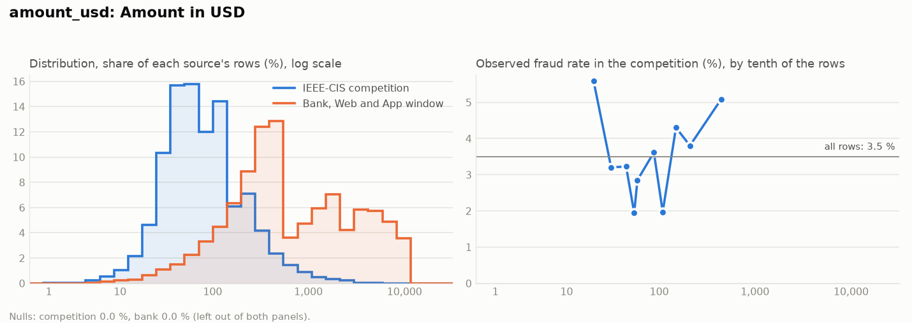

### `log_amount_usd`

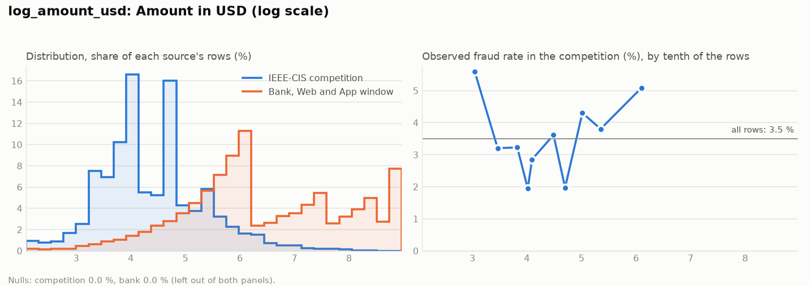

### `amount_has_cents`

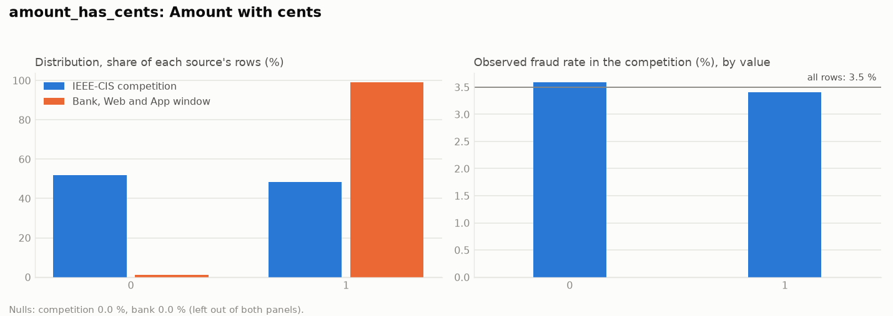

### `hour_sin`

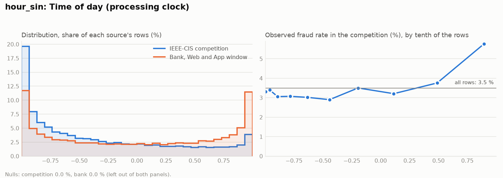

### `hour_cos`

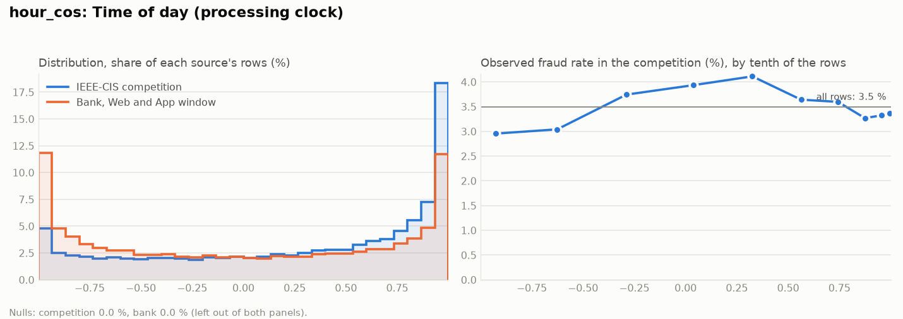

### `day_of_week`

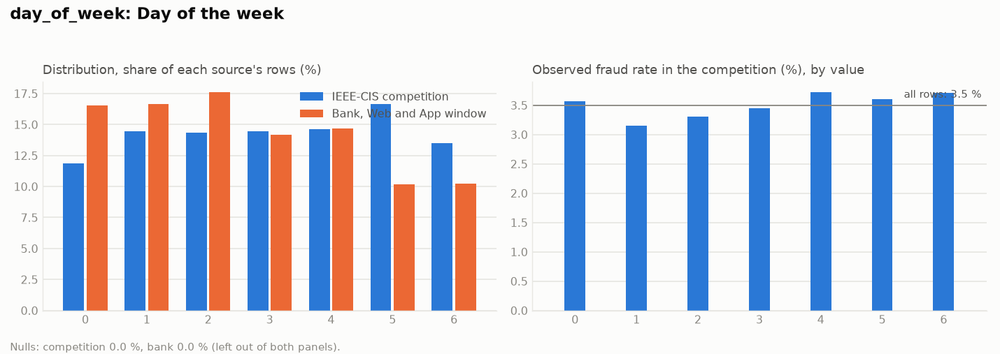

### `card_kind_credit`

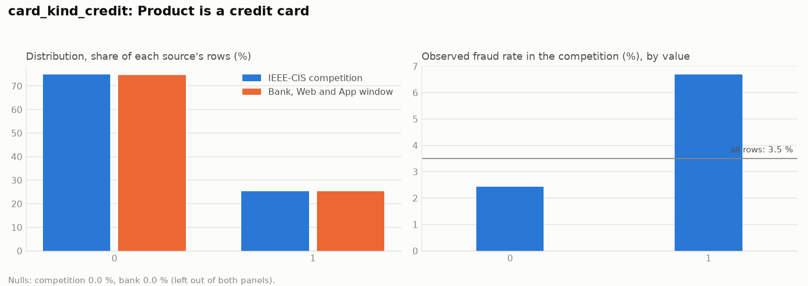

### `card_kind_debit`

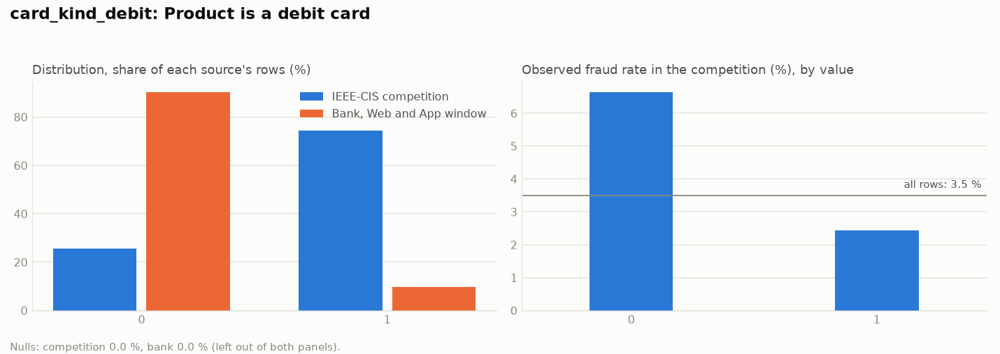

### `days_since_prev_tx_card`

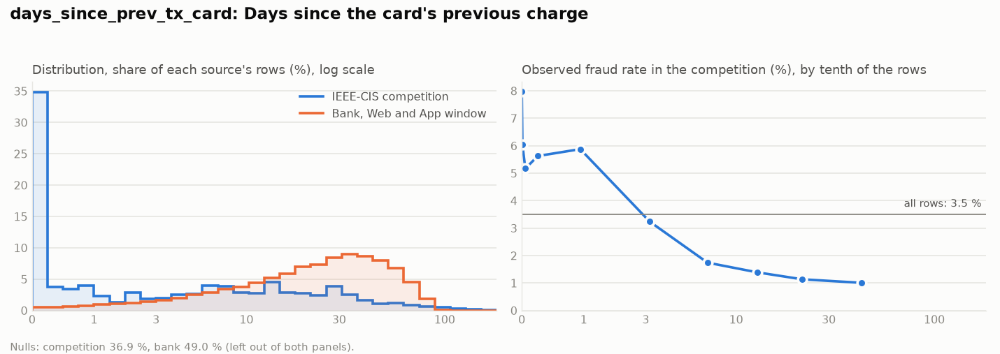

### `tx_count_card_1d`

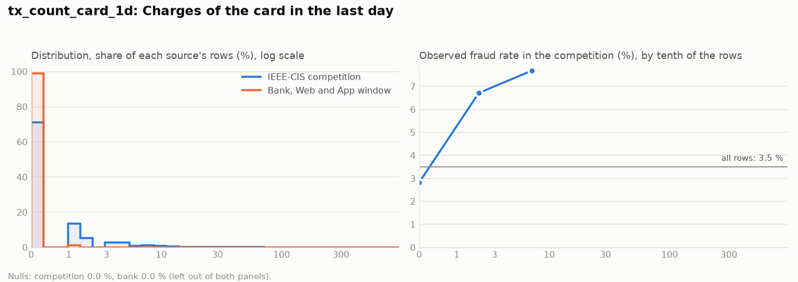

### `tx_count_card_7d`

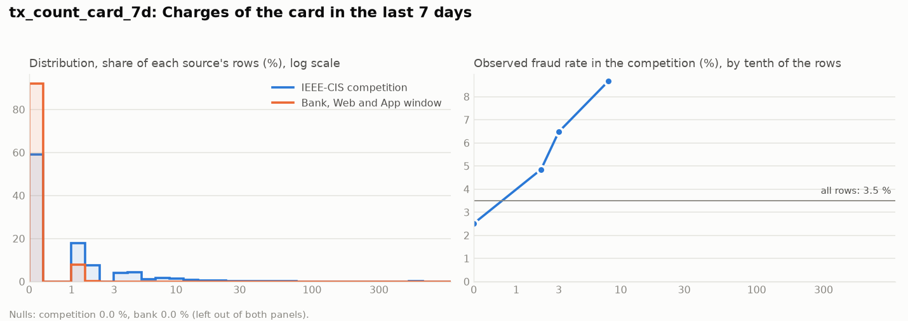

### `tx_count_card_30d`

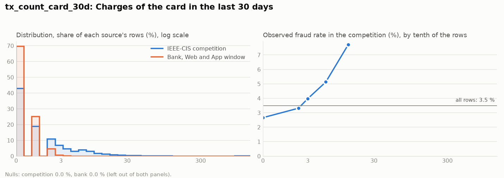

### `tx_sum_card_7d`

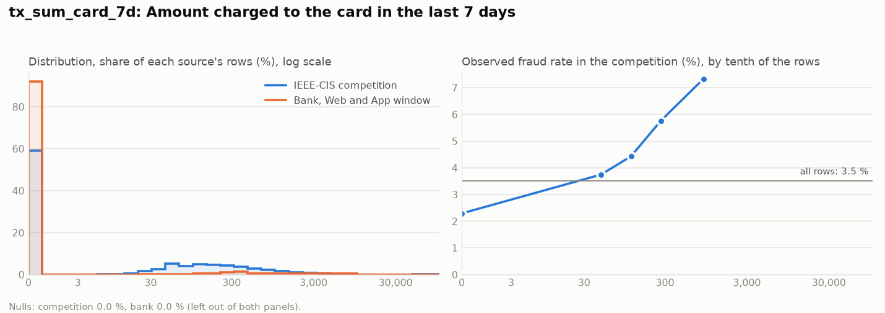

### `amount_mean_card_hist`

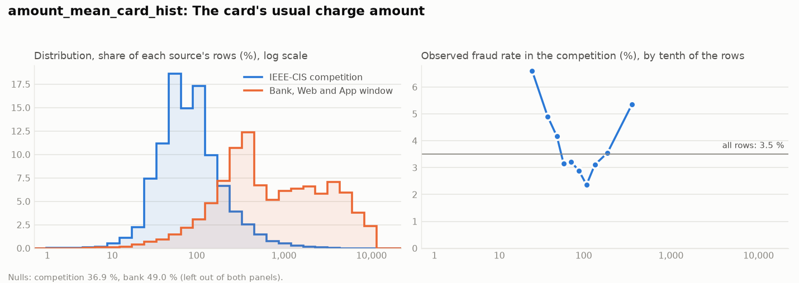

### `amount_std_card_hist`

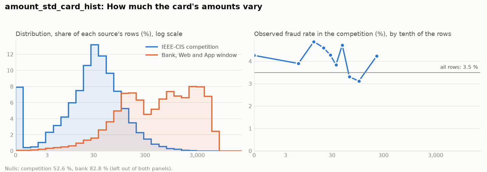

### `amount_zscore_card`

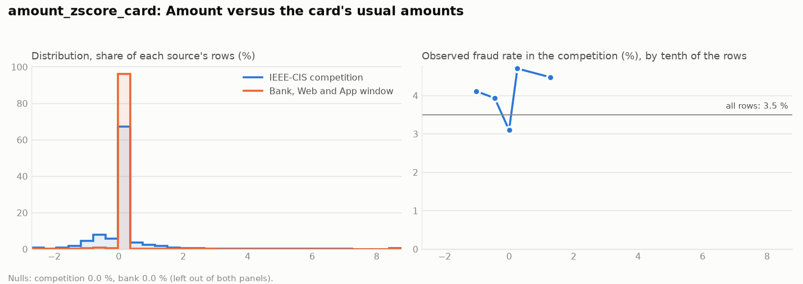

### `ratio_to_historical_avg`

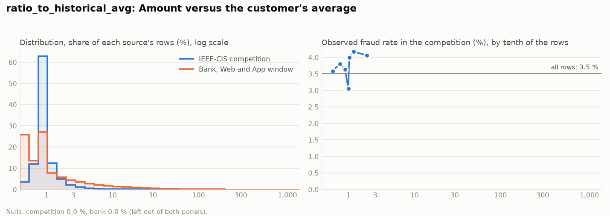

### `address_distance_bucket`

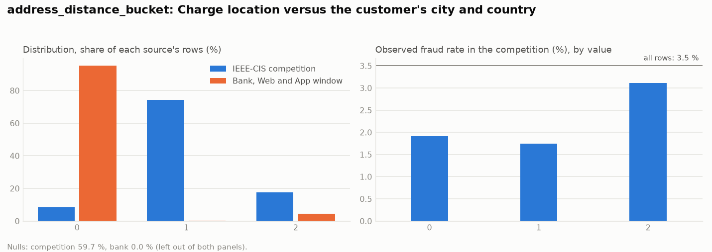

### `consistency_matches`

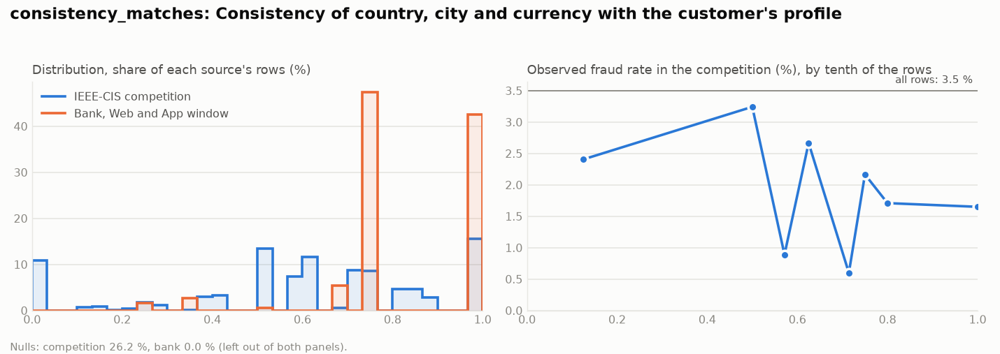

## Observed against predicted on the competition

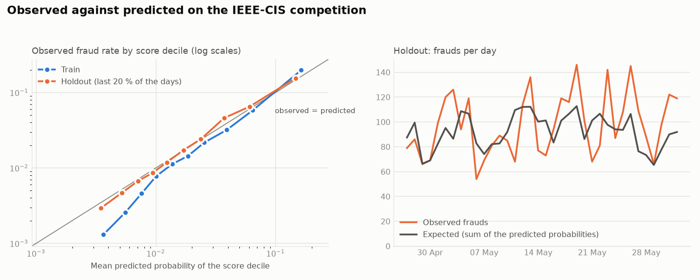

Totals: train 17,150 observed against 17,131 expected; holdout 3,513 observed against 3,315 expected.

### Train, by score decile

| Decile | Rows | Score range | Mean predicted % | Observed frauds | Observed % |
| --- | --- | --- | --- | --- | --- |
| 1 | 48,784 | 0.0012 to 0.0046 | 0.37 | 64 | 0.13 |
| 2 | 48,784 | 0.0046 to 0.0065 | 0.55 | 125 | 0.26 |
| 3 | 48,784 | 0.0065 to 0.0088 | 0.76 | 224 | 0.46 |
| 4 | 48,784 | 0.0088 to 0.0116 | 1.01 | 380 | 0.78 |
| 5 | 48,784 | 0.0116 to 0.0160 | 1.36 | 547 | 1.12 |
| 6 | 48,784 | 0.0160 to 0.0213 | 1.85 | 703 | 1.44 |
| 7 | 48,784 | 0.0213 to 0.0306 | 2.54 | 1,059 | 2.17 |
| 8 | 48,783 | 0.0306 to 0.0488 | 3.90 | 1,556 | 3.19 |
| 9 | 48,783 | 0.0488 to 0.0850 | 6.43 | 2,829 | 5.80 |
| 10 | 48,783 | 0.0850 to 0.9722 | 16.34 | 9,663 | 19.81 |

### Holdout, by score decile

| Decile | Rows | Score range | Mean predicted % | Observed frauds | Observed % |
| --- | --- | --- | --- | --- | --- |
| 1 | 10,271 | 0.0013 to 0.0044 | 0.35 | 30 | 0.29 |
| 2 | 10,271 | 0.0044 to 0.0061 | 0.52 | 48 | 0.47 |
| 3 | 10,271 | 0.0061 to 0.0082 | 0.71 | 69 | 0.67 |
| 4 | 10,270 | 0.0082 to 0.0106 | 0.94 | 88 | 0.86 |
| 5 | 10,270 | 0.0106 to 0.0144 | 1.24 | 122 | 1.19 |
| 6 | 10,270 | 0.0144 to 0.0199 | 1.70 | 177 | 1.72 |
| 7 | 10,270 | 0.0199 to 0.0290 | 2.38 | 248 | 2.41 |
| 8 | 10,270 | 0.0290 to 0.0463 | 3.70 | 470 | 4.58 |
| 9 | 10,270 | 0.0463 to 0.0796 | 6.06 | 668 | 6.50 |
| 10 | 10,270 | 0.0796 to 0.8366 | 14.70 | 1,593 | 15.51 |

## Bank: `is_fraud` flags by score decile

The bank label has no learnable signal, so this table is a check, not a validation: the flags should spread evenly.

| Decile | Charges | Score range | Mean score % | `is_fraud` flags |
| --- | --- | --- | --- | --- |
| 1 | 7,537 | 0.0015 to 0.0050 | 0.41 | 11 |
| 2 | 7,537 | 0.0050 to 0.0062 | 0.57 | 8 |
| 3 | 7,537 | 0.0062 to 0.0072 | 0.67 | 3 |
| 4 | 7,537 | 0.0072 to 0.0083 | 0.78 | 7 |
| 5 | 7,537 | 0.0083 to 0.0094 | 0.88 | 1 |
| 6 | 7,537 | 0.0094 to 0.0104 | 0.99 | 9 |
| 7 | 7,536 | 0.0104 to 0.0114 | 1.08 | 9 |
| 8 | 7,536 | 0.0114 to 0.0133 | 1.22 | 10 |
| 9 | 7,536 | 0.0133 to 0.0210 | 1.61 | 9 |
| 10 | 7,536 | 0.0210 to 0.7095 | 4.88 | 6 |
